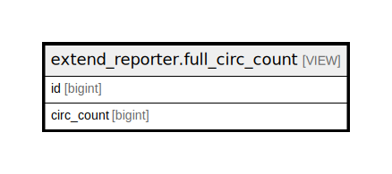

# extend_reporter.full_circ_count

## Description

<details>
<summary><strong>Table Definition</strong></summary>

```sql
CREATE VIEW full_circ_count AS (
 SELECT cp.id,
    ((COALESCE(( SELECT legacy_circ_count.circ_count
           FROM extend_reporter.legacy_circ_count
          WHERE (legacy_circ_count.id = cp.id)), 0) + ( SELECT count(*) AS count
           FROM action.circulation
          WHERE (circulation.target_copy = cp.id))) + ( SELECT count(*) AS count
           FROM action.aged_circulation
          WHERE (aged_circulation.target_copy = cp.id))) AS circ_count
   FROM asset.copy cp
)
```

</details>

## Columns

| Name | Type | Default | Nullable | Children | Parents | Comment |
| ---- | ---- | ------- | -------- | -------- | ------- | ------- |
| id | bigint |  | true |  |  |  |
| circ_count | bigint |  | true |  |  |  |

## Referenced Tables

| Name | Columns | Comment | Type |
| ---- | ------- | ------- | ---- |
| [extend_reporter.legacy_circ_count](extend_reporter.legacy_circ_count.md) | 2 |  | BASE TABLE |
| [action.circulation](action.circulation.md) | 34 |  | BASE TABLE |
| [action.aged_circulation](action.aged_circulation.md) | 41 |  | BASE TABLE |
| [asset.copy](asset.copy.md) | 33 |  | BASE TABLE |

## Relations



---

> Generated by [tbls](https://github.com/k1LoW/tbls)
