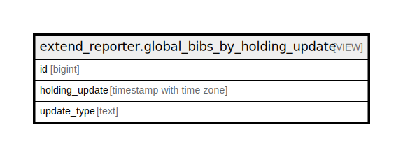

# extend_reporter.global_bibs_by_holding_update

## Description

<details>
<summary><strong>Table Definition</strong></summary>

```sql
CREATE VIEW global_bibs_by_holding_update AS (
 SELECT DISTINCT ON (x.id) x.id,
    x.holding_update,
    x.update_type
   FROM ( SELECT b.id,
            last(cp.create_date) AS holding_update,
            'add'::text AS update_type
           FROM ((biblio.record_entry b
             JOIN asset.call_number cn ON ((cn.record = b.id)))
             JOIN asset.copy cp ON ((cp.call_number = cn.id)))
          WHERE ((NOT cp.deleted) AND (b.id > 0))
          GROUP BY b.id
        UNION
         SELECT b.id,
            last(cp.edit_date) AS holding_update,
            'delete'::text AS update_type
           FROM ((biblio.record_entry b
             JOIN asset.call_number cn ON ((cn.record = b.id)))
             JOIN asset.copy cp ON ((cp.call_number = cn.id)))
          WHERE (cp.deleted AND (b.id > 0))
          GROUP BY b.id) x
  ORDER BY x.id, x.holding_update
)
```

</details>

## Columns

| Name | Type | Default | Nullable | Children | Parents | Comment |
| ---- | ---- | ------- | -------- | -------- | ------- | ------- |
| id | bigint |  | true |  |  |  |
| holding_update | timestamp with time zone |  | true |  |  |  |
| update_type | text |  | true |  |  |  |

## Referenced Tables

| Name | Columns | Comment | Type |
| ---- | ------- | ------- | ---- |
| [biblio.record_entry](biblio.record_entry.md) | 19 |  | BASE TABLE |
| [asset.call_number](asset.call_number.md) | 13 |  | BASE TABLE |
| [asset.copy](asset.copy.md) | 33 |  | BASE TABLE |

## Relations



---

> Generated by [tbls](https://github.com/k1LoW/tbls)
