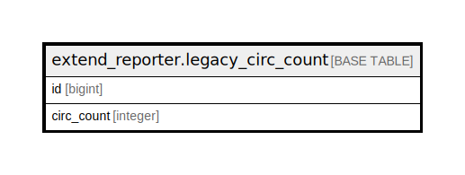

# extend_reporter.legacy_circ_count

## Description

## Columns

| Name | Type | Default | Nullable | Children | Parents | Comment |
| ---- | ---- | ------- | -------- | -------- | ------- | ------- |
| id | bigint |  | false |  |  |  |
| circ_count | integer | 0 | false |  |  |  |

## Constraints

| Name | Type | Definition |
| ---- | ---- | ---------- |
| legacy_circ_count_pkey | PRIMARY KEY | PRIMARY KEY (id) |

## Indexes

| Name | Definition |
| ---- | ---------- |
| legacy_circ_count_pkey | CREATE UNIQUE INDEX legacy_circ_count_pkey ON extend_reporter.legacy_circ_count USING btree (id) |

## Relations

---

> Generated by [tbls](https://github.com/k1LoW/tbls)
