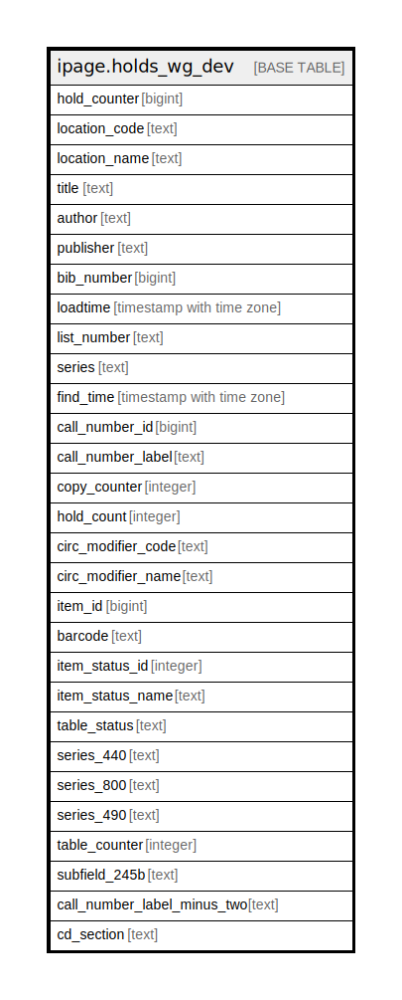

# ipage.holds_wg_dev

## Description

## Columns

| Name | Type | Default | Nullable | Children | Parents | Comment |
| ---- | ---- | ------- | -------- | -------- | ------- | ------- |
| hold_counter | bigint |  | true |  |  |  |
| location_code | text |  | true |  |  |  |
| location_name | text |  | true |  |  |  |
| title | text |  | true |  |  |  |
| author | text |  | true |  |  |  |
| publisher | text |  | true |  |  |  |
| bib_number | bigint |  | true |  |  |  |
| loadtime | timestamp with time zone |  | true |  |  |  |
| list_number | text |  | true |  |  |  |
| series | text |  | true |  |  |  |
| find_time | timestamp with time zone |  | true |  |  |  |
| call_number_id | bigint |  | true |  |  |  |
| call_number_label | text |  | true |  |  |  |
| copy_counter | integer |  | true |  |  |  |
| hold_count | integer |  | true |  |  |  |
| circ_modifier_code | text |  | true |  |  |  |
| circ_modifier_name | text |  | true |  |  |  |
| item_id | bigint |  | true |  |  |  |
| barcode | text |  | true |  |  |  |
| item_status_id | integer |  | true |  |  |  |
| item_status_name | text |  | true |  |  |  |
| table_status | text |  | true |  |  |  |
| series_440 | text |  | true |  |  |  |
| series_800 | text |  | true |  |  |  |
| series_490 | text |  | true |  |  |  |
| table_counter | integer |  | true |  |  |  |
| subfield_245b | text |  | true |  |  |  |
| call_number_label_minus_two | text |  | true |  |  |  |
| cd_section | text |  | true |  |  |  |

## Relations

---

> Generated by [tbls](https://github.com/k1LoW/tbls)
