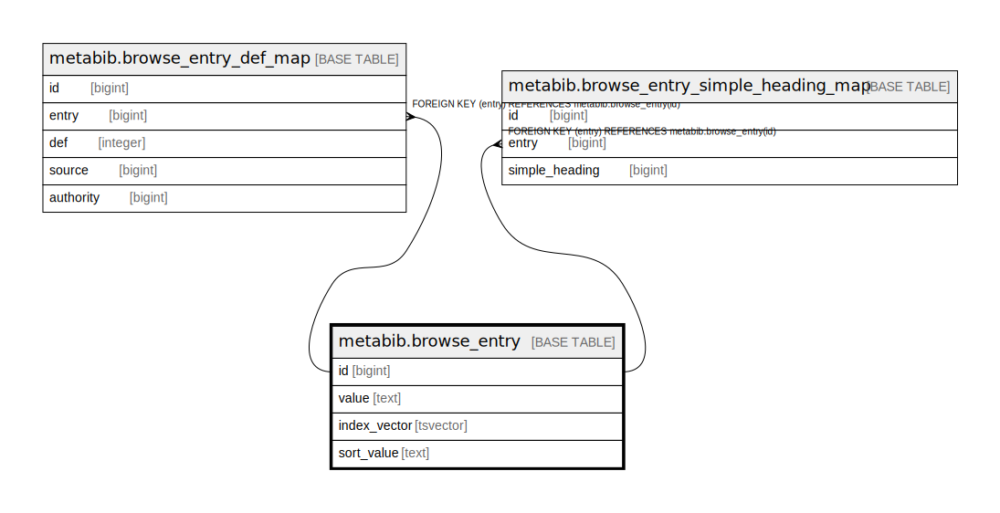

# metabib.browse_entry

## Description

## Columns

| Name | Type | Default | Nullable | Children | Parents | Comment |
| ---- | ---- | ------- | -------- | -------- | ------- | ------- |
| id | bigint | nextval('metabib.browse_entry_id_seq'::regclass) | false | [metabib.browse_entry_def_map](metabib.browse_entry_def_map.md) [metabib.browse_entry_simple_heading_map](metabib.browse_entry_simple_heading_map.md) |  |  |
| value | text |  | true |  |  |  |
| index_vector | tsvector |  | true |  |  |  |
| sort_value | text |  | false |  |  |  |

## Constraints

| Name | Type | Definition |
| ---- | ---- | ---------- |
| browse_entry_pkey | PRIMARY KEY | PRIMARY KEY (id) |
| browse_entry_sort_value_value_key | UNIQUE | UNIQUE (sort_value, value) |

## Indexes

| Name | Definition |
| ---- | ---------- |
| browse_entry_pkey | CREATE UNIQUE INDEX browse_entry_pkey ON metabib.browse_entry USING btree (id) |
| browse_entry_sort_value_value_key | CREATE UNIQUE INDEX browse_entry_sort_value_value_key ON metabib.browse_entry USING btree (sort_value, value) |
| browse_entry_sort_value_idx | CREATE INDEX browse_entry_sort_value_idx ON metabib.browse_entry USING btree (sort_value) |
| metabib_browse_entry_index_vector_idx | CREATE INDEX metabib_browse_entry_index_vector_idx ON metabib.browse_entry USING gin (index_vector) |

## Triggers

| Name | Definition |
| ---- | ---------- |
| metabib_browse_entry_fti_trigger | CREATE TRIGGER metabib_browse_entry_fti_trigger BEFORE INSERT OR UPDATE ON metabib.browse_entry FOR EACH ROW EXECUTE PROCEDURE oils_tsearch2('keyword') |

## Relations

---

> Generated by [tbls](https://github.com/k1LoW/tbls)
