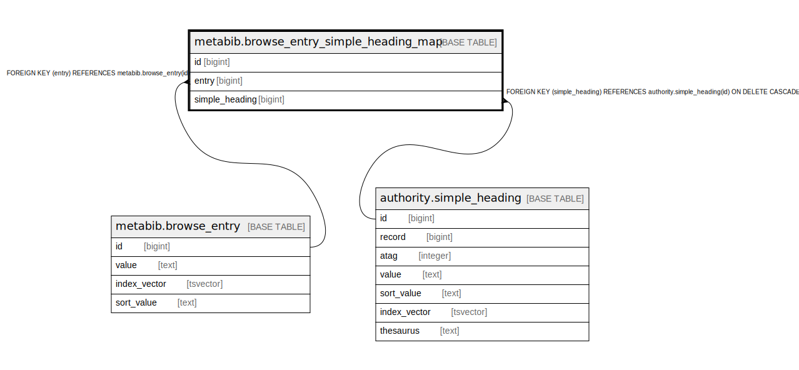

# metabib.browse_entry_simple_heading_map

## Description

## Columns

| Name | Type | Default | Nullable | Children | Parents | Comment |
| ---- | ---- | ------- | -------- | -------- | ------- | ------- |
| id | bigint | nextval('metabib.browse_entry_simple_heading_map_id_seq'::regclass) | false |  |  |  |
| entry | bigint |  | true |  | [metabib.browse_entry](metabib.browse_entry.md) |  |
| simple_heading | bigint |  | true |  | [authority.simple_heading](authority.simple_heading.md) |  |

## Constraints

| Name | Type | Definition |
| ---- | ---- | ---------- |
| browse_entry_simple_heading_map_simple_heading_fkey | FOREIGN KEY | FOREIGN KEY (simple_heading) REFERENCES authority.simple_heading(id) ON DELETE CASCADE |
| browse_entry_simple_heading_map_entry_fkey | FOREIGN KEY | FOREIGN KEY (entry) REFERENCES metabib.browse_entry(id) |
| browse_entry_simple_heading_map_pkey | PRIMARY KEY | PRIMARY KEY (id) |

## Indexes

| Name | Definition |
| ---- | ---------- |
| browse_entry_simple_heading_map_pkey | CREATE UNIQUE INDEX browse_entry_simple_heading_map_pkey ON metabib.browse_entry_simple_heading_map USING btree (id) |
| browse_entry_sh_map_entry_idx | CREATE INDEX browse_entry_sh_map_entry_idx ON metabib.browse_entry_simple_heading_map USING btree (entry) |
| browse_entry_sh_map_sh_idx | CREATE INDEX browse_entry_sh_map_sh_idx ON metabib.browse_entry_simple_heading_map USING btree (simple_heading) |

## Relations

---

> Generated by [tbls](https://github.com/k1LoW/tbls)
