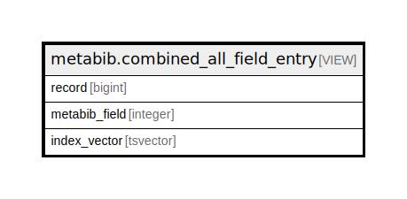

# metabib.combined_all_field_entry

## Description

<details>
<summary><strong>Table Definition</strong></summary>

```sql
CREATE VIEW combined_all_field_entry AS (
 SELECT combined_title_field_entry.record,
    combined_title_field_entry.metabib_field,
    combined_title_field_entry.index_vector
   FROM metabib.combined_title_field_entry
UNION ALL
 SELECT combined_author_field_entry.record,
    combined_author_field_entry.metabib_field,
    combined_author_field_entry.index_vector
   FROM metabib.combined_author_field_entry
UNION ALL
 SELECT combined_subject_field_entry.record,
    combined_subject_field_entry.metabib_field,
    combined_subject_field_entry.index_vector
   FROM metabib.combined_subject_field_entry
UNION ALL
 SELECT combined_keyword_field_entry.record,
    combined_keyword_field_entry.metabib_field,
    combined_keyword_field_entry.index_vector
   FROM metabib.combined_keyword_field_entry
UNION ALL
 SELECT combined_identifier_field_entry.record,
    combined_identifier_field_entry.metabib_field,
    combined_identifier_field_entry.index_vector
   FROM metabib.combined_identifier_field_entry
UNION ALL
 SELECT combined_series_field_entry.record,
    combined_series_field_entry.metabib_field,
    combined_series_field_entry.index_vector
   FROM metabib.combined_series_field_entry
)
```

</details>

## Columns

| Name | Type | Default | Nullable | Children | Parents | Comment |
| ---- | ---- | ------- | -------- | -------- | ------- | ------- |
| record | bigint |  | true |  |  |  |
| metabib_field | integer |  | true |  |  |  |
| index_vector | tsvector |  | true |  |  |  |

## Referenced Tables

| Name | Columns | Comment | Type |
| ---- | ------- | ------- | ---- |
| [metabib.combined_title_field_entry](metabib.combined_title_field_entry.md) | 3 |  | BASE TABLE |
| [metabib.combined_author_field_entry](metabib.combined_author_field_entry.md) | 3 |  | BASE TABLE |
| [metabib.combined_subject_field_entry](metabib.combined_subject_field_entry.md) | 3 |  | BASE TABLE |
| [metabib.combined_keyword_field_entry](metabib.combined_keyword_field_entry.md) | 3 |  | BASE TABLE |
| [metabib.combined_identifier_field_entry](metabib.combined_identifier_field_entry.md) | 3 |  | BASE TABLE |
| [metabib.combined_series_field_entry](metabib.combined_series_field_entry.md) | 3 |  | BASE TABLE |

## Relations



---

> Generated by [tbls](https://github.com/k1LoW/tbls)
