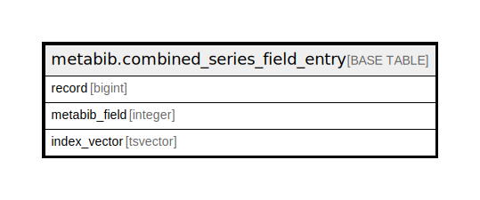

# metabib.combined_series_field_entry

## Description

## Columns

| Name | Type | Default | Nullable | Children | Parents | Comment |
| ---- | ---- | ------- | -------- | -------- | ------- | ------- |
| record | bigint |  | false |  |  |  |
| metabib_field | integer |  | true |  |  |  |
| index_vector | tsvector |  | false |  |  |  |

## Indexes

| Name | Definition |
| ---- | ---------- |
| metabib_combined_series_field_entry_fakepk_idx | CREATE UNIQUE INDEX metabib_combined_series_field_entry_fakepk_idx ON metabib.combined_series_field_entry USING btree (record, COALESCE((metabib_field)::text, ''::text)) |
| metabib_combined_series_field_entry_index_vector_idx | CREATE INDEX metabib_combined_series_field_entry_index_vector_idx ON metabib.combined_series_field_entry USING gin (index_vector) |
| metabib_combined_series_field_source_idx | CREATE INDEX metabib_combined_series_field_source_idx ON metabib.combined_series_field_entry USING btree (metabib_field) |

## Relations

---

> Generated by [tbls](https://github.com/k1LoW/tbls)
