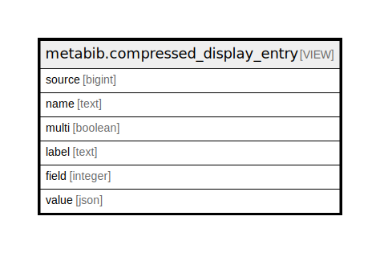

# metabib.compressed_display_entry

## Description

<details>
<summary><strong>Table Definition</strong></summary>

```sql
CREATE VIEW compressed_display_entry AS (
 SELECT flat_display_entry.source,
    flat_display_entry.name,
    flat_display_entry.multi,
    flat_display_entry.label,
    flat_display_entry.field,
        CASE
            WHEN flat_display_entry.multi THEN to_json(array_agg(flat_display_entry.value))
            ELSE to_json(min(flat_display_entry.value))
        END AS value
   FROM metabib.flat_display_entry
  GROUP BY flat_display_entry.source, flat_display_entry.name, flat_display_entry.multi, flat_display_entry.label, flat_display_entry.field
)
```

</details>

## Columns

| Name | Type | Default | Nullable | Children | Parents | Comment |
| ---- | ---- | ------- | -------- | -------- | ------- | ------- |
| source | bigint |  | true |  |  |  |
| name | text |  | true |  |  |  |
| multi | boolean |  | true |  |  |  |
| label | text |  | true |  |  |  |
| field | integer |  | true |  |  |  |
| value | json |  | true |  |  |  |

## Referenced Tables

| Name | Columns | Comment | Type |
| ---- | ------- | ------- | ---- |
| [metabib.flat_display_entry](metabib.flat_display_entry.md) | 6 |  | VIEW |

## Relations



---

> Generated by [tbls](https://github.com/k1LoW/tbls)
