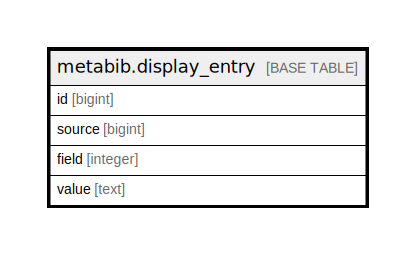

# metabib.display_entry

## Description

## Columns

| Name | Type | Default | Nullable | Children | Parents | Comment |
| ---- | ---- | ------- | -------- | -------- | ------- | ------- |
| id | bigint | nextval('metabib.display_entry_id_seq'::regclass) | false |  |  |  |
| source | bigint |  | false |  |  |  |
| field | integer |  | false |  |  |  |
| value | text |  | false |  |  |  |

## Constraints

| Name | Type | Definition |
| ---- | ---- | ---------- |
| display_entry_pkey | PRIMARY KEY | PRIMARY KEY (id) |

## Indexes

| Name | Definition |
| ---- | ---------- |
| display_entry_pkey | CREATE UNIQUE INDEX display_entry_pkey ON metabib.display_entry USING btree (id) |
| metabib_display_entry_field_idx | CREATE INDEX metabib_display_entry_field_idx ON metabib.display_entry USING btree (field) |
| metabib_display_entry_source_idx | CREATE INDEX metabib_display_entry_source_idx ON metabib.display_entry USING btree (source) |

## Triggers

| Name | Definition |
| ---- | ---------- |
| display_field_force_nfc_tgr | CREATE TRIGGER display_field_force_nfc_tgr BEFORE INSERT OR UPDATE ON metabib.display_entry FOR EACH ROW EXECUTE PROCEDURE display_field_force_nfc() |
| display_field_normalize_tgr | CREATE TRIGGER display_field_normalize_tgr BEFORE INSERT OR UPDATE ON metabib.display_entry FOR EACH ROW EXECUTE PROCEDURE metabib.display_field_normalize_trigger() |

## Relations

---

> Generated by [tbls](https://github.com/k1LoW/tbls)
