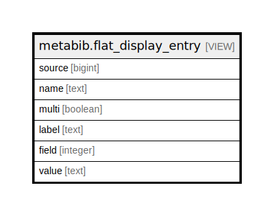

# metabib.flat_display_entry

## Description

<details>
<summary><strong>Table Definition</strong></summary>

```sql
CREATE VIEW flat_display_entry AS (
 SELECT mde.source,
    cdfm.name,
    cdfm.multi,
    cmf.label,
    cmf.id AS field,
    mde.value
   FROM ((metabib.display_entry mde
     JOIN config.metabib_field cmf ON ((cmf.id = mde.field)))
     JOIN config.display_field_map cdfm ON ((cdfm.field = mde.field)))
)
```

</details>

## Columns

| Name | Type | Default | Nullable | Children | Parents | Comment |
| ---- | ---- | ------- | -------- | -------- | ------- | ------- |
| source | bigint |  | true |  |  |  |
| name | text |  | true |  |  |  |
| multi | boolean |  | true |  |  |  |
| label | text |  | true |  |  |  |
| field | integer |  | true |  |  |  |
| value | text |  | true |  |  |  |

## Referenced Tables

| Name | Columns | Comment | Type |
| ---- | ------- | ------- | ---- |
| [metabib.display_entry](metabib.display_entry.md) | 4 |  | BASE TABLE |
| [config.metabib_field](config.metabib_field.md) | 18 | <br>XPath used for record indexing ingest<br><br>This table contains the XPath used to chop up MODS into its<br>indexable parts.  Each XPath entry is named and assigned to<br>a "class" of either title, subject, author, keyword, series<br>or identifier.<br> | BASE TABLE |
| [config.display_field_map](config.display_field_map.md) | 3 |  | BASE TABLE |

## Relations



---

> Generated by [tbls](https://github.com/k1LoW/tbls)
