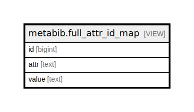

# metabib.full_attr_id_map

## Description

<details>
<summary><strong>Table Definition</strong></summary>

```sql
CREATE VIEW full_attr_id_map AS (
 SELECT record_attr_id_map.id,
    record_attr_id_map.attr,
    record_attr_id_map.value
   FROM metabib.record_attr_id_map
UNION
 SELECT composite_attr_id_map.id,
    composite_attr_id_map.attr,
    composite_attr_id_map.value
   FROM metabib.composite_attr_id_map
)
```

</details>

## Columns

| Name | Type | Default | Nullable | Children | Parents | Comment |
| ---- | ---- | ------- | -------- | -------- | ------- | ------- |
| id | bigint |  | true |  |  |  |
| attr | text |  | true |  |  |  |
| value | text |  | true |  |  |  |

## Referenced Tables

| Name | Columns | Comment | Type |
| ---- | ------- | ------- | ---- |
| [metabib.record_attr_id_map](metabib.record_attr_id_map.md) | 3 |  | VIEW |
| [metabib.composite_attr_id_map](metabib.composite_attr_id_map.md) | 3 |  | VIEW |

## Relations



---

> Generated by [tbls](https://github.com/k1LoW/tbls)
