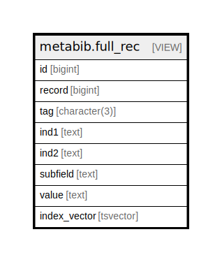

# metabib.full_rec

## Description

<details>
<summary><strong>Table Definition</strong></summary>

```sql
CREATE VIEW full_rec AS (
 SELECT real_full_rec.id,
    real_full_rec.record,
    real_full_rec.tag,
    real_full_rec.ind1,
    real_full_rec.ind2,
    real_full_rec.subfield,
    "substring"(real_full_rec.value, 1, 1024) AS value,
    real_full_rec.index_vector
   FROM metabib.real_full_rec
)
```

</details>

## Columns

| Name | Type | Default | Nullable | Children | Parents | Comment |
| ---- | ---- | ------- | -------- | -------- | ------- | ------- |
| id | bigint |  | true |  |  |  |
| record | bigint |  | true |  |  |  |
| tag | character(3) |  | true |  |  |  |
| ind1 | text |  | true |  |  |  |
| ind2 | text |  | true |  |  |  |
| subfield | text |  | true |  |  |  |
| value | text |  | true |  |  |  |
| index_vector | tsvector |  | true |  |  |  |

## Referenced Tables

| Name | Columns | Comment | Type |
| ---- | ------- | ------- | ---- |
| [metabib.real_full_rec](metabib.real_full_rec.md) | 8 |  | BASE TABLE |

## Relations



---

> Generated by [tbls](https://github.com/k1LoW/tbls)
