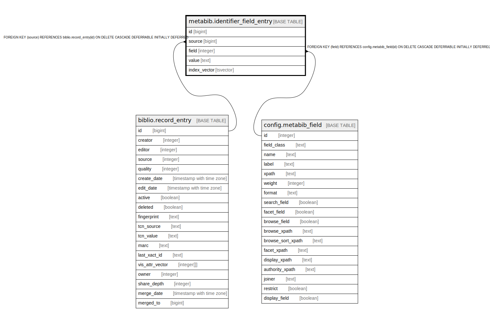

# metabib.identifier_field_entry

## Description

## Columns

| Name | Type | Default | Nullable | Children | Parents | Comment |
| ---- | ---- | ------- | -------- | -------- | ------- | ------- |
| id | bigint | nextval('metabib.identifier_field_entry_id_seq'::regclass) | false |  |  |  |
| source | bigint |  | false |  | [biblio.record_entry](biblio.record_entry.md) |  |
| field | integer |  | false |  | [config.metabib_field](config.metabib_field.md) |  |
| value | text |  | false |  |  |  |
| index_vector | tsvector |  | false |  |  |  |

## Constraints

| Name | Type | Definition |
| ---- | ---- | ---------- |
| metabib_identifier_field_entry_source_pkey | FOREIGN KEY | FOREIGN KEY (source) REFERENCES biblio.record_entry(id) ON DELETE CASCADE DEFERRABLE INITIALLY DEFERRED |
| metabib_identifier_field_entry_field_pkey | FOREIGN KEY | FOREIGN KEY (field) REFERENCES config.metabib_field(id) ON DELETE CASCADE DEFERRABLE INITIALLY DEFERRED |
| identifier_field_entry_pkey | PRIMARY KEY | PRIMARY KEY (id) |

## Indexes

| Name | Definition |
| ---- | ---------- |
| identifier_field_entry_pkey | CREATE UNIQUE INDEX identifier_field_entry_pkey ON metabib.identifier_field_entry USING btree (id) |
| metabib_identifier_field_entry_index_vector_idx | CREATE INDEX metabib_identifier_field_entry_index_vector_idx ON metabib.identifier_field_entry USING gin (index_vector) |
| metabib_identifier_field_entry_source_idx | CREATE INDEX metabib_identifier_field_entry_source_idx ON metabib.identifier_field_entry USING btree (source) |
| metabib_identifier_field_entry_value_idx | CREATE INDEX metabib_identifier_field_entry_value_idx ON metabib.identifier_field_entry USING btree ("substring"(value, 1, 1024)) WHERE (index_vector = ''::tsvector) |

## Triggers

| Name | Definition |
| ---- | ---------- |
| metabib_identifier_field_entry_fti_trigger | CREATE TRIGGER metabib_identifier_field_entry_fti_trigger BEFORE INSERT OR UPDATE ON metabib.identifier_field_entry FOR EACH ROW EXECUTE PROCEDURE oils_tsearch2('identifier') |

## Relations

---

> Generated by [tbls](https://github.com/k1LoW/tbls)
