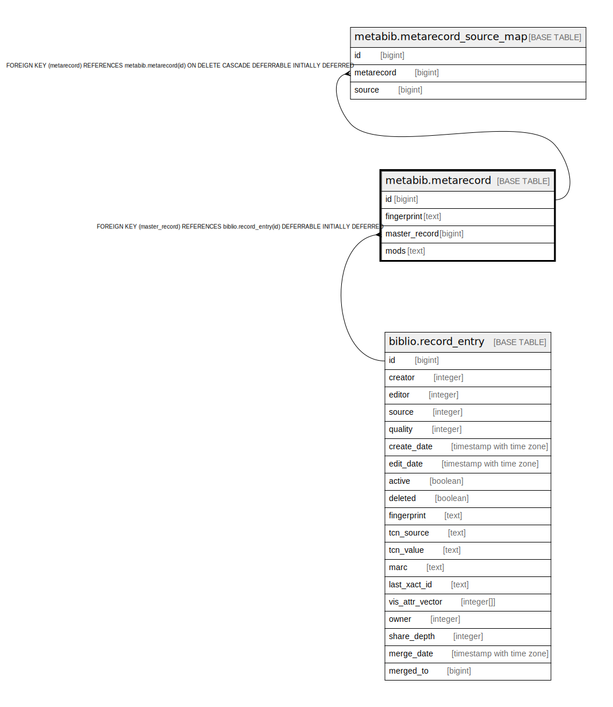

# metabib.metarecord

## Description

## Columns

| Name | Type | Default | Nullable | Children | Parents | Comment |
| ---- | ---- | ------- | -------- | -------- | ------- | ------- |
| id | bigint | nextval('metabib.metarecord_id_seq'::regclass) | false | [metabib.metarecord_source_map](metabib.metarecord_source_map.md) |  |  |
| fingerprint | text |  | false |  |  |  |
| master_record | bigint |  | true |  | [biblio.record_entry](biblio.record_entry.md) |  |
| mods | text |  | true |  |  |  |

## Constraints

| Name | Type | Definition |
| ---- | ---- | ---------- |
| metabib_metarecord_master_record_fkey | FOREIGN KEY | FOREIGN KEY (master_record) REFERENCES biblio.record_entry(id) DEFERRABLE INITIALLY DEFERRED |
| metarecord_pkey | PRIMARY KEY | PRIMARY KEY (id) |

## Indexes

| Name | Definition |
| ---- | ---------- |
| metarecord_pkey | CREATE UNIQUE INDEX metarecord_pkey ON metabib.metarecord USING btree (id) |
| metabib_metarecord_fingerprint_idx | CREATE INDEX metabib_metarecord_fingerprint_idx ON metabib.metarecord USING btree (fingerprint) |
| metabib_metarecord_master_record_idx | CREATE INDEX metabib_metarecord_master_record_idx ON metabib.metarecord USING btree (master_record) |

## Relations

---

> Generated by [tbls](https://github.com/k1LoW/tbls)
