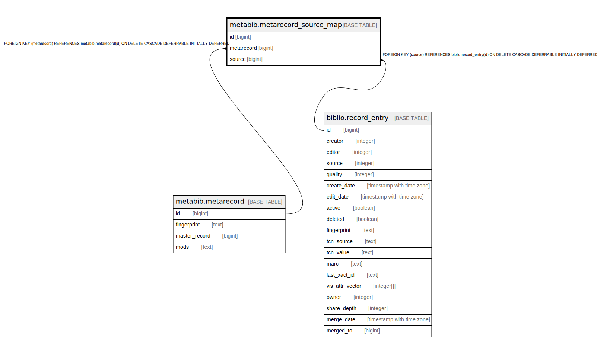

# metabib.metarecord_source_map

## Description

## Columns

| Name | Type | Default | Nullable | Children | Parents | Comment |
| ---- | ---- | ------- | -------- | -------- | ------- | ------- |
| id | bigint | nextval('metabib.metarecord_source_map_id_seq'::regclass) | false |  |  |  |
| metarecord | bigint |  | false |  | [metabib.metarecord](metabib.metarecord.md) |  |
| source | bigint |  | false |  | [biblio.record_entry](biblio.record_entry.md) |  |

## Constraints

| Name | Type | Definition |
| ---- | ---- | ---------- |
| metabib_metarecord_source_map_source_fkey | FOREIGN KEY | FOREIGN KEY (source) REFERENCES biblio.record_entry(id) ON DELETE CASCADE DEFERRABLE INITIALLY DEFERRED |
| metabib_metarecord_source_map_metarecord_fkey | FOREIGN KEY | FOREIGN KEY (metarecord) REFERENCES metabib.metarecord(id) ON DELETE CASCADE DEFERRABLE INITIALLY DEFERRED |
| metarecord_source_map_pkey | PRIMARY KEY | PRIMARY KEY (id) |

## Indexes

| Name | Definition |
| ---- | ---------- |
| metarecord_source_map_pkey | CREATE UNIQUE INDEX metarecord_source_map_pkey ON metabib.metarecord_source_map USING btree (id) |
| metabib_metarecord_source_map_metarecord_idx | CREATE INDEX metabib_metarecord_source_map_metarecord_idx ON metabib.metarecord_source_map USING btree (metarecord) |
| metabib_metarecord_source_map_source_record_idx | CREATE INDEX metabib_metarecord_source_map_source_record_idx ON metabib.metarecord_source_map USING btree (source) |

## Relations

---

> Generated by [tbls](https://github.com/k1LoW/tbls)
