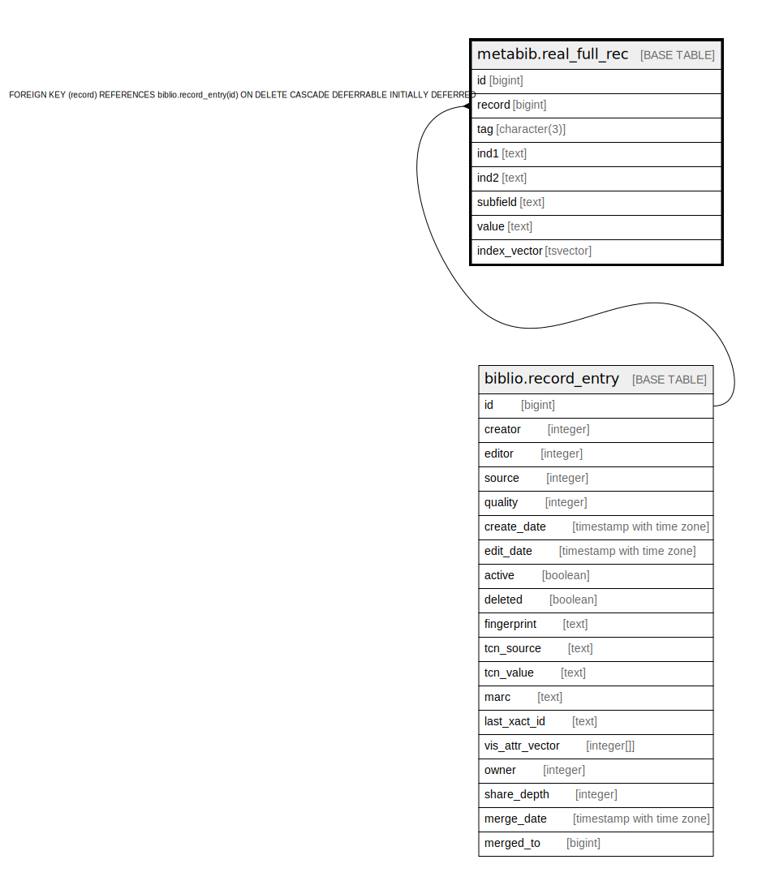

# metabib.real_full_rec

## Description

## Columns

| Name | Type | Default | Nullable | Children | Parents | Comment |
| ---- | ---- | ------- | -------- | -------- | ------- | ------- |
| id | bigint | nextval('metabib.full_rec_id_seq'::regclass) | false |  |  |  |
| record | bigint |  | false |  | [biblio.record_entry](biblio.record_entry.md) |  |
| tag | character(3) |  | false |  |  |  |
| ind1 | text |  | true |  |  |  |
| ind2 | text |  | true |  |  |  |
| subfield | text |  | true |  |  |  |
| value | text |  | false |  |  |  |
| index_vector | tsvector |  | false |  |  |  |

## Constraints

| Name | Type | Definition |
| ---- | ---- | ---------- |
| metabib_full_rec_record_fkey | FOREIGN KEY | FOREIGN KEY (record) REFERENCES biblio.record_entry(id) ON DELETE CASCADE DEFERRABLE INITIALLY DEFERRED |
| real_full_rec_pkey | PRIMARY KEY | PRIMARY KEY (id) |

## Indexes

| Name | Definition |
| ---- | ---------- |
| real_full_rec_pkey | CREATE UNIQUE INDEX real_full_rec_pkey ON metabib.real_full_rec USING btree (id) |
| metabib_full_rec_02x_tag_subfield_lower_substring | CREATE INDEX metabib_full_rec_02x_tag_subfield_lower_substring ON metabib.real_full_rec USING btree (tag, subfield, lower("substring"(value, 1, 1024))) WHERE (tag = ANY (ARRAY['020'::bpchar, '022'::bpchar, '024'::bpchar])) |
| metabib_full_rec_index_vector_idx | CREATE INDEX metabib_full_rec_index_vector_idx ON metabib.real_full_rec USING gin (index_vector) |
| metabib_full_rec_isxn_caseless_idx | CREATE INDEX metabib_full_rec_isxn_caseless_idx ON metabib.real_full_rec USING btree (lower(value)) WHERE (tag = ANY (ARRAY['020'::bpchar, '022'::bpchar, '024'::bpchar])) |
| metabib_full_rec_record_idx | CREATE INDEX metabib_full_rec_record_idx ON metabib.real_full_rec USING btree (record) |
| metabib_full_rec_tag_subfield_idx | CREATE INDEX metabib_full_rec_tag_subfield_idx ON metabib.real_full_rec USING btree (tag, subfield) |
| metabib_full_rec_value_idx | CREATE INDEX metabib_full_rec_value_idx ON metabib.real_full_rec USING btree ("substring"(value, 1, 1024)) |
| metabib_full_rec_value_tpo_index | CREATE INDEX metabib_full_rec_value_tpo_index ON metabib.real_full_rec USING btree ("substring"(value, 1, 1024) text_pattern_ops) |

## Triggers

| Name | Definition |
| ---- | ---------- |
| metabib_full_rec_fti_trigger | CREATE TRIGGER metabib_full_rec_fti_trigger BEFORE INSERT OR UPDATE ON metabib.real_full_rec FOR EACH ROW EXECUTE PROCEDURE oils_tsearch2('default') |

## Relations

---

> Generated by [tbls](https://github.com/k1LoW/tbls)
