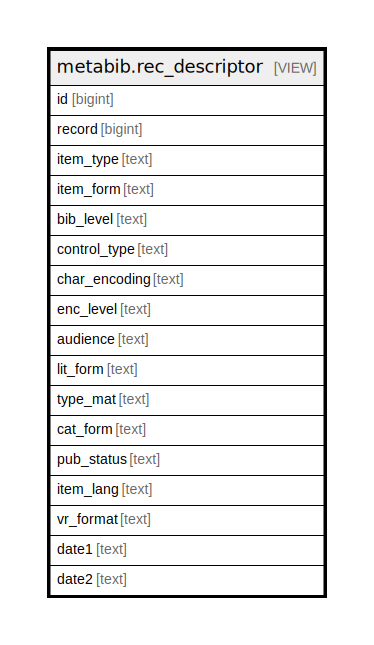

# metabib.rec_descriptor

## Description

<details>
<summary><strong>Table Definition</strong></summary>

```sql
CREATE VIEW rec_descriptor AS (
 SELECT record_attr.id,
    record_attr.id AS record,
    (populate_record(NULL::metabib.rec_desc_type, record_attr.attrs)).item_type AS item_type,
    (populate_record(NULL::metabib.rec_desc_type, record_attr.attrs)).item_form AS item_form,
    (populate_record(NULL::metabib.rec_desc_type, record_attr.attrs)).bib_level AS bib_level,
    (populate_record(NULL::metabib.rec_desc_type, record_attr.attrs)).control_type AS control_type,
    (populate_record(NULL::metabib.rec_desc_type, record_attr.attrs)).char_encoding AS char_encoding,
    (populate_record(NULL::metabib.rec_desc_type, record_attr.attrs)).enc_level AS enc_level,
    (populate_record(NULL::metabib.rec_desc_type, record_attr.attrs)).audience AS audience,
    (populate_record(NULL::metabib.rec_desc_type, record_attr.attrs)).lit_form AS lit_form,
    (populate_record(NULL::metabib.rec_desc_type, record_attr.attrs)).type_mat AS type_mat,
    (populate_record(NULL::metabib.rec_desc_type, record_attr.attrs)).cat_form AS cat_form,
    (populate_record(NULL::metabib.rec_desc_type, record_attr.attrs)).pub_status AS pub_status,
    (populate_record(NULL::metabib.rec_desc_type, record_attr.attrs)).item_lang AS item_lang,
    (populate_record(NULL::metabib.rec_desc_type, record_attr.attrs)).vr_format AS vr_format,
    (populate_record(NULL::metabib.rec_desc_type, record_attr.attrs)).date1 AS date1,
    (populate_record(NULL::metabib.rec_desc_type, record_attr.attrs)).date2 AS date2
   FROM metabib.record_attr
)
```

</details>

## Columns

| Name | Type | Default | Nullable | Children | Parents | Comment |
| ---- | ---- | ------- | -------- | -------- | ------- | ------- |
| id | bigint |  | true |  |  |  |
| record | bigint |  | true |  |  |  |
| item_type | text |  | true |  |  |  |
| item_form | text |  | true |  |  |  |
| bib_level | text |  | true |  |  |  |
| control_type | text |  | true |  |  |  |
| char_encoding | text |  | true |  |  |  |
| enc_level | text |  | true |  |  |  |
| audience | text |  | true |  |  |  |
| lit_form | text |  | true |  |  |  |
| type_mat | text |  | true |  |  |  |
| cat_form | text |  | true |  |  |  |
| pub_status | text |  | true |  |  |  |
| item_lang | text |  | true |  |  |  |
| vr_format | text |  | true |  |  |  |
| date1 | text |  | true |  |  |  |
| date2 | text |  | true |  |  |  |

## Referenced Tables

| Name | Columns | Comment | Type |
| ---- | ------- | ------- | ---- |
| [metabib.record_attr](metabib.record_attr.md) | 2 |  | VIEW |

## Relations



---

> Generated by [tbls](https://github.com/k1LoW/tbls)
