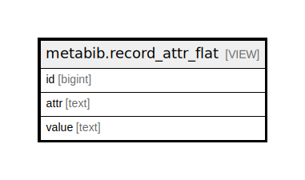

# metabib.record_attr_flat

## Description

<details>
<summary><strong>Table Definition</strong></summary>

```sql
CREATE VIEW record_attr_flat AS (
 SELECT v.source AS id,
    m.attr,
    m.value
   FROM (metabib.record_attr_vector_list v
     LEFT JOIN metabib.uncontrolled_record_attr_value m ON ((m.id = ANY (v.vlist))))
UNION
 SELECT v.source AS id,
    c.ctype AS attr,
    c.code AS value
   FROM (metabib.record_attr_vector_list v
     LEFT JOIN config.coded_value_map c ON ((c.id = ANY (v.vlist))))
)
```

</details>

## Columns

| Name | Type | Default | Nullable | Children | Parents | Comment |
| ---- | ---- | ------- | -------- | -------- | ------- | ------- |
| id | bigint |  | true |  |  |  |
| attr | text |  | true |  |  |  |
| value | text |  | true |  |  |  |

## Referenced Tables

| Name | Columns | Comment | Type |
| ---- | ------- | ------- | ---- |
| [metabib.record_attr_vector_list](metabib.record_attr_vector_list.md) | 2 |  | BASE TABLE |
| [metabib.uncontrolled_record_attr_value](metabib.uncontrolled_record_attr_value.md) | 3 |  | BASE TABLE |
| [config.coded_value_map](config.coded_value_map.md) | 9 |  | BASE TABLE |

## Relations



---

> Generated by [tbls](https://github.com/k1LoW/tbls)
