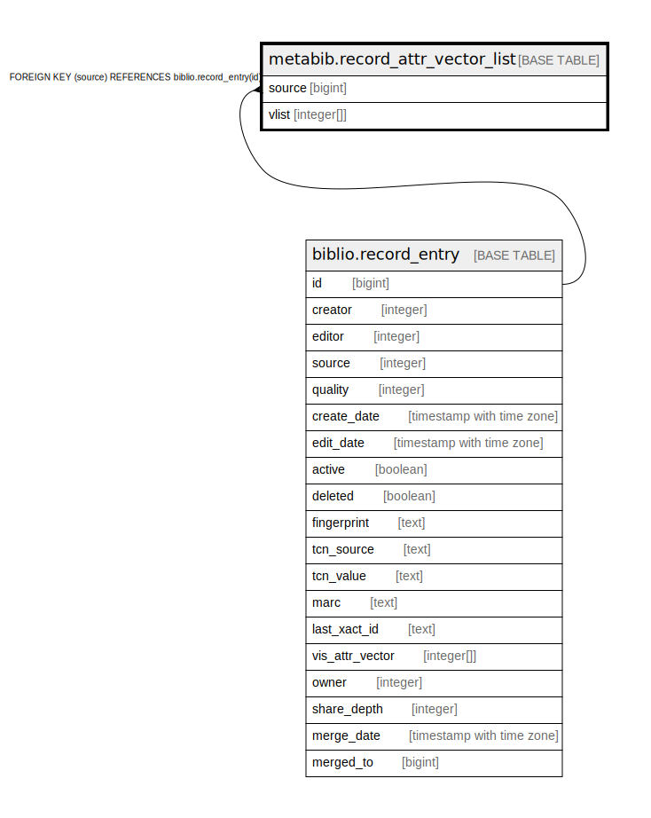

# metabib.record_attr_vector_list

## Description

## Columns

| Name | Type | Default | Nullable | Children | Parents | Comment |
| ---- | ---- | ------- | -------- | -------- | ------- | ------- |
| source | bigint |  | false |  | [biblio.record_entry](biblio.record_entry.md) |  |
| vlist | integer[] |  | false |  |  |  |

## Constraints

| Name | Type | Definition |
| ---- | ---- | ---------- |
| record_attr_vector_list_source_fkey | FOREIGN KEY | FOREIGN KEY (source) REFERENCES biblio.record_entry(id) |
| record_attr_vector_list_pkey | PRIMARY KEY | PRIMARY KEY (source) |

## Indexes

| Name | Definition |
| ---- | ---------- |
| record_attr_vector_list_pkey | CREATE UNIQUE INDEX record_attr_vector_list_pkey ON metabib.record_attr_vector_list USING btree (source) |
| mrca_vlist_idx | CREATE INDEX mrca_vlist_idx ON metabib.record_attr_vector_list USING gin (vlist gin__int_ops) |

## Relations

---

> Generated by [tbls](https://github.com/k1LoW/tbls)
