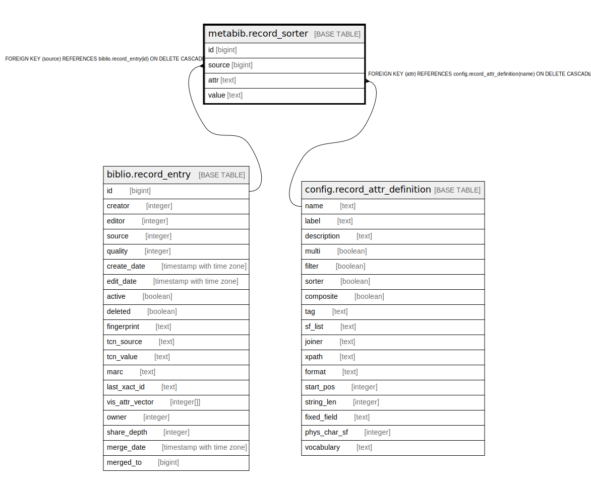

# metabib.record_sorter

## Description

## Columns

| Name | Type | Default | Nullable | Children | Parents | Comment |
| ---- | ---- | ------- | -------- | -------- | ------- | ------- |
| id | bigint | nextval('metabib.record_sorter_id_seq'::regclass) | false |  |  |  |
| source | bigint |  | false |  | [biblio.record_entry](biblio.record_entry.md) |  |
| attr | text |  | false |  | [config.record_attr_definition](config.record_attr_definition.md) |  |
| value | text |  | false |  |  |  |

## Constraints

| Name | Type | Definition |
| ---- | ---- | ---------- |
| record_sorter_source_fkey | FOREIGN KEY | FOREIGN KEY (source) REFERENCES biblio.record_entry(id) ON DELETE CASCADE |
| record_sorter_attr_fkey | FOREIGN KEY | FOREIGN KEY (attr) REFERENCES config.record_attr_definition(name) ON DELETE CASCADE |
| record_sorter_pkey | PRIMARY KEY | PRIMARY KEY (id) |

## Indexes

| Name | Definition |
| ---- | ---------- |
| record_sorter_pkey | CREATE UNIQUE INDEX record_sorter_pkey ON metabib.record_sorter USING btree (id) |
| metabib_sorter_a_v_idx | CREATE INDEX metabib_sorter_a_v_idx ON metabib.record_sorter USING btree (attr, value) |
| metabib_sorter_s_a_idx | CREATE INDEX metabib_sorter_s_a_idx ON metabib.record_sorter USING btree (source, attr) |
| metabib_sorter_source_idx | CREATE INDEX metabib_sorter_source_idx ON metabib.record_sorter USING btree (source) |

## Relations

---

> Generated by [tbls](https://github.com/k1LoW/tbls)
