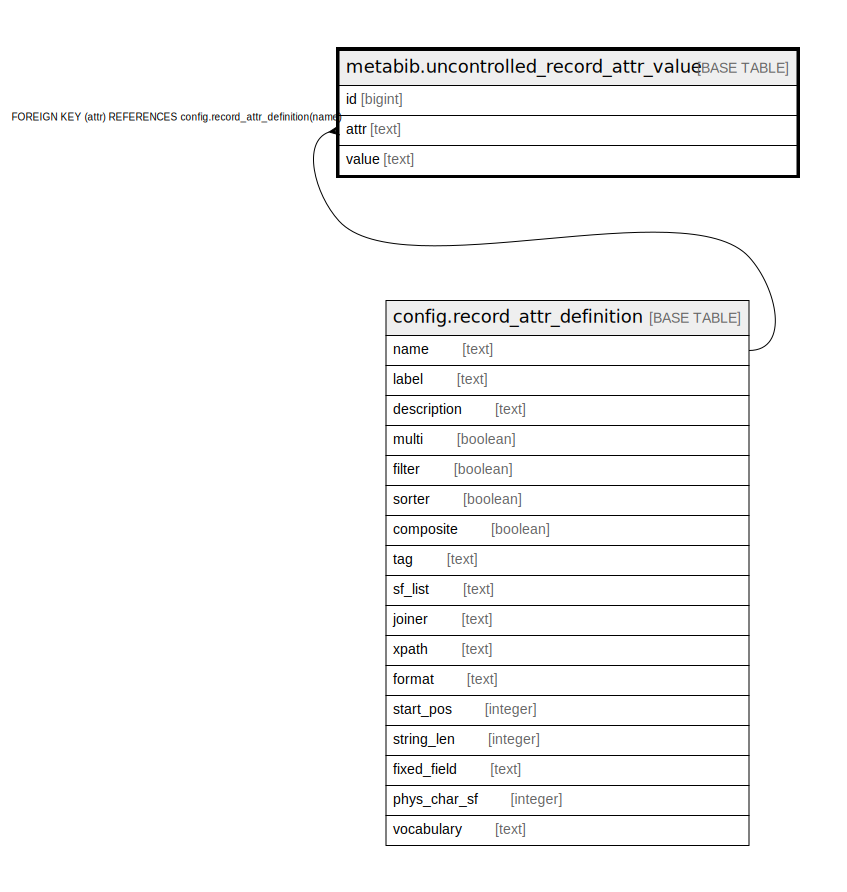

# metabib.uncontrolled_record_attr_value

## Description

## Columns

| Name | Type | Default | Nullable | Children | Parents | Comment |
| ---- | ---- | ------- | -------- | -------- | ------- | ------- |
| id | bigint | nextval('metabib.uncontrolled_record_attr_value_id_seq'::regclass) | false |  |  |  |
| attr | text |  | false |  | [config.record_attr_definition](config.record_attr_definition.md) |  |
| value | text |  | false |  |  |  |

## Constraints

| Name | Type | Definition |
| ---- | ---- | ---------- |
| uncontrolled_record_attr_value_attr_fkey | FOREIGN KEY | FOREIGN KEY (attr) REFERENCES config.record_attr_definition(name) |
| uncontrolled_record_attr_value_pkey | PRIMARY KEY | PRIMARY KEY (id) |

## Indexes

| Name | Definition |
| ---- | ---------- |
| uncontrolled_record_attr_value_pkey | CREATE UNIQUE INDEX uncontrolled_record_attr_value_pkey ON metabib.uncontrolled_record_attr_value USING btree (id) |
| muv_once_idx | CREATE UNIQUE INDEX muv_once_idx ON metabib.uncontrolled_record_attr_value USING btree (attr, value) |

## Relations

---

> Generated by [tbls](https://github.com/k1LoW/tbls)
