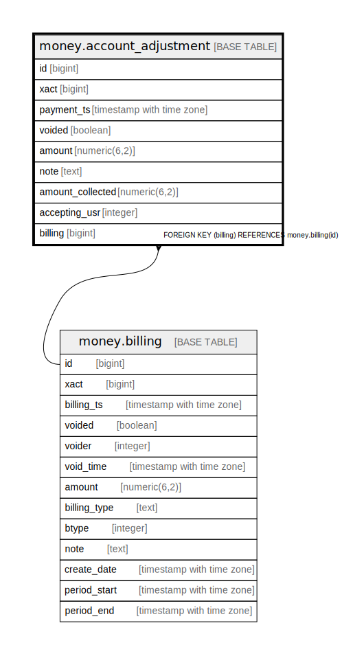

# money.account_adjustment

## Description

## Columns

| Name | Type | Default | Nullable | Children | Parents | Comment |
| ---- | ---- | ------- | -------- | -------- | ------- | ------- |
| id | bigint | nextval('money.payment_id_seq'::regclass) | false |  |  |  |
| xact | bigint |  | false |  |  |  |
| payment_ts | timestamp with time zone | now() | false |  |  |  |
| voided | boolean | false | false |  |  |  |
| amount | numeric(6,2) |  | false |  |  |  |
| note | text |  | true |  |  |  |
| amount_collected | numeric(6,2) |  | false |  |  |  |
| accepting_usr | integer |  | false |  |  |  |
| billing | bigint |  | true |  | [money.billing](money.billing.md) |  |

## Constraints

| Name | Type | Definition |
| ---- | ---- | ---------- |
| account_adjustment_pkey | PRIMARY KEY | PRIMARY KEY (id) |
| account_adjustment_billing_fkey | FOREIGN KEY | FOREIGN KEY (billing) REFERENCES money.billing(id) |

## Indexes

| Name | Definition |
| ---- | ---------- |
| account_adjustment_pkey | CREATE UNIQUE INDEX account_adjustment_pkey ON money.account_adjustment USING btree (id) |
| money_account_adjustment_accepting_usr_idx | CREATE INDEX money_account_adjustment_accepting_usr_idx ON money.account_adjustment USING btree (accepting_usr) |
| money_account_adjustment_bill_idx | CREATE INDEX money_account_adjustment_bill_idx ON money.account_adjustment USING btree (billing) |
| money_account_adjustment_payment_ts_idx | CREATE INDEX money_account_adjustment_payment_ts_idx ON money.account_adjustment USING btree (payment_ts) |
| money_account_adjustment_xact_idx | CREATE INDEX money_account_adjustment_xact_idx ON money.account_adjustment USING btree (xact) |
| money_adjustment_id_idx | CREATE INDEX money_adjustment_id_idx ON money.account_adjustment USING btree (id) |

## Triggers

| Name | Definition |
| ---- | ---------- |
| mat_summary_add_tgr | CREATE TRIGGER mat_summary_add_tgr AFTER INSERT ON money.account_adjustment FOR EACH ROW EXECUTE PROCEDURE money.materialized_summary_payment_add('account_adjustment') |
| mat_summary_del_tgr | CREATE TRIGGER mat_summary_del_tgr BEFORE DELETE ON money.account_adjustment FOR EACH ROW EXECUTE PROCEDURE money.materialized_summary_payment_del('account_adjustment') |
| mat_summary_upd_tgr | CREATE TRIGGER mat_summary_upd_tgr AFTER UPDATE ON money.account_adjustment FOR EACH ROW EXECUTE PROCEDURE money.materialized_summary_payment_update('account_adjustment') |

## Relations

---

> Generated by [tbls](https://github.com/k1LoW/tbls)
