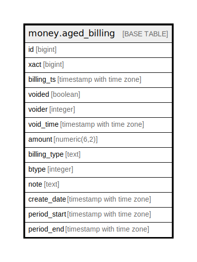

# money.aged_billing

## Description

## Columns

| Name | Type | Default | Nullable | Children | Parents | Comment |
| ---- | ---- | ------- | -------- | -------- | ------- | ------- |
| id | bigint |  | false |  |  |  |
| xact | bigint |  | false |  |  |  |
| billing_ts | timestamp with time zone |  | false |  |  |  |
| voided | boolean |  | false |  |  |  |
| voider | integer |  | true |  |  |  |
| void_time | timestamp with time zone |  | true |  |  |  |
| amount | numeric(6,2) |  | false |  |  |  |
| billing_type | text |  | false |  |  |  |
| btype | integer |  | false |  |  |  |
| note | text |  | true |  |  |  |
| create_date | timestamp with time zone |  | false |  |  |  |
| period_start | timestamp with time zone |  | true |  |  |  |
| period_end | timestamp with time zone |  | true |  |  |  |

## Constraints

| Name | Type | Definition |
| ---- | ---- | ---------- |
| aged_billing_pkey | PRIMARY KEY | PRIMARY KEY (id) |

## Indexes

| Name | Definition |
| ---- | ---------- |
| aged_billing_pkey | CREATE UNIQUE INDEX aged_billing_pkey ON money.aged_billing USING btree (id) |
| aged_billing_billing_ts_idx | CREATE INDEX aged_billing_billing_ts_idx ON money.aged_billing USING btree (billing_ts) |
| aged_billing_create_date_idx | CREATE INDEX aged_billing_create_date_idx ON money.aged_billing USING btree (create_date) |
| aged_billing_period_end_idx | CREATE INDEX aged_billing_period_end_idx ON money.aged_billing USING btree (period_end) |
| aged_billing_period_start_idx | CREATE INDEX aged_billing_period_start_idx ON money.aged_billing USING btree (period_start) |
| aged_billing_voider_idx | CREATE INDEX aged_billing_voider_idx ON money.aged_billing USING btree (voider) |
| aged_billing_xact_idx | CREATE INDEX aged_billing_xact_idx ON money.aged_billing USING btree (xact) |

## Relations

---

> Generated by [tbls](https://github.com/k1LoW/tbls)
