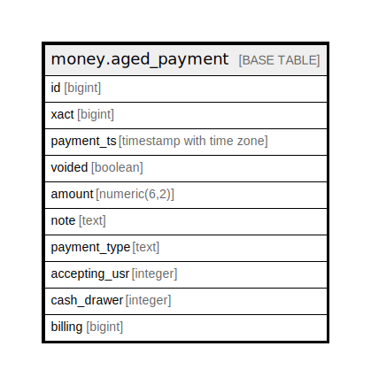

# money.aged_payment

## Description

## Columns

| Name | Type | Default | Nullable | Children | Parents | Comment |
| ---- | ---- | ------- | -------- | -------- | ------- | ------- |
| id | bigint |  | false |  |  |  |
| xact | bigint |  | false |  |  |  |
| payment_ts | timestamp with time zone |  | false |  |  |  |
| voided | boolean |  | false |  |  |  |
| amount | numeric(6,2) |  | false |  |  |  |
| note | text |  | true |  |  |  |
| payment_type | text |  | false |  |  |  |
| accepting_usr | integer |  | true |  |  |  |
| cash_drawer | integer |  | true |  |  |  |
| billing | bigint |  | true |  |  |  |

## Constraints

| Name | Type | Definition |
| ---- | ---- | ---------- |
| aged_payment_pkey | PRIMARY KEY | PRIMARY KEY (id) |

## Indexes

| Name | Definition |
| ---- | ---------- |
| aged_payment_pkey | CREATE UNIQUE INDEX aged_payment_pkey ON money.aged_payment USING btree (id) |
| aged_payment_accepting_usr_idx | CREATE INDEX aged_payment_accepting_usr_idx ON money.aged_payment USING btree (accepting_usr) |
| aged_payment_billing_idx | CREATE INDEX aged_payment_billing_idx ON money.aged_payment USING btree (billing) |
| aged_payment_cash_drawer_idx | CREATE INDEX aged_payment_cash_drawer_idx ON money.aged_payment USING btree (cash_drawer) |
| aged_payment_payment_ts_idx | CREATE INDEX aged_payment_payment_ts_idx ON money.aged_payment USING btree (payment_ts) |
| aged_payment_xact_idx | CREATE INDEX aged_payment_xact_idx ON money.aged_payment USING btree (xact) |

## Relations

---

> Generated by [tbls](https://github.com/k1LoW/tbls)
