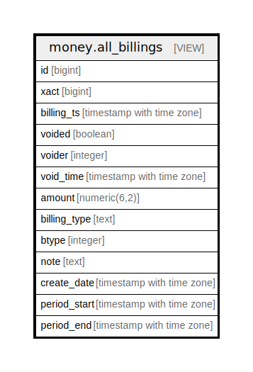

# money.all_billings

## Description

<details>
<summary><strong>Table Definition</strong></summary>

```sql
CREATE VIEW all_billings AS (
 SELECT billing.id,
    billing.xact,
    billing.billing_ts,
    billing.voided,
    billing.voider,
    billing.void_time,
    billing.amount,
    billing.billing_type,
    billing.btype,
    billing.note,
    billing.create_date,
    billing.period_start,
    billing.period_end
   FROM money.billing
UNION ALL
 SELECT aged_billing.id,
    aged_billing.xact,
    aged_billing.billing_ts,
    aged_billing.voided,
    aged_billing.voider,
    aged_billing.void_time,
    aged_billing.amount,
    aged_billing.billing_type,
    aged_billing.btype,
    aged_billing.note,
    aged_billing.create_date,
    aged_billing.period_start,
    aged_billing.period_end
   FROM money.aged_billing
)
```

</details>

## Columns

| Name | Type | Default | Nullable | Children | Parents | Comment |
| ---- | ---- | ------- | -------- | -------- | ------- | ------- |
| id | bigint |  | true |  |  |  |
| xact | bigint |  | true |  |  |  |
| billing_ts | timestamp with time zone |  | true |  |  |  |
| voided | boolean |  | true |  |  |  |
| voider | integer |  | true |  |  |  |
| void_time | timestamp with time zone |  | true |  |  |  |
| amount | numeric(6,2) |  | true |  |  |  |
| billing_type | text |  | true |  |  |  |
| btype | integer |  | true |  |  |  |
| note | text |  | true |  |  |  |
| create_date | timestamp with time zone |  | true |  |  |  |
| period_start | timestamp with time zone |  | true |  |  |  |
| period_end | timestamp with time zone |  | true |  |  |  |

## Referenced Tables

| Name | Columns | Comment | Type |
| ---- | ------- | ------- | ---- |
| [money.billing](money.billing.md) | 13 |  | BASE TABLE |
| [money.aged_billing](money.aged_billing.md) | 13 |  | BASE TABLE |

## Relations



---

> Generated by [tbls](https://github.com/k1LoW/tbls)
