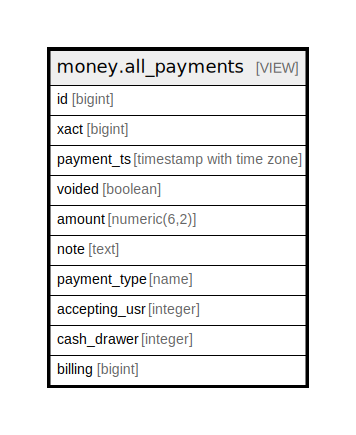

# money.all_payments

## Description

<details>
<summary><strong>Table Definition</strong></summary>

```sql
CREATE VIEW all_payments AS (
 SELECT payment_view_for_aging.id,
    payment_view_for_aging.xact,
    payment_view_for_aging.payment_ts,
    payment_view_for_aging.voided,
    payment_view_for_aging.amount,
    payment_view_for_aging.note,
    payment_view_for_aging.payment_type,
    payment_view_for_aging.accepting_usr,
    payment_view_for_aging.cash_drawer,
    payment_view_for_aging.billing
   FROM money.payment_view_for_aging
UNION ALL
 SELECT aged_payment.id,
    aged_payment.xact,
    aged_payment.payment_ts,
    aged_payment.voided,
    aged_payment.amount,
    aged_payment.note,
    aged_payment.payment_type,
    aged_payment.accepting_usr,
    aged_payment.cash_drawer,
    aged_payment.billing
   FROM money.aged_payment
)
```

</details>

## Columns

| Name | Type | Default | Nullable | Children | Parents | Comment |
| ---- | ---- | ------- | -------- | -------- | ------- | ------- |
| id | bigint |  | true |  |  |  |
| xact | bigint |  | true |  |  |  |
| payment_ts | timestamp with time zone |  | true |  |  |  |
| voided | boolean |  | true |  |  |  |
| amount | numeric(6,2) |  | true |  |  |  |
| note | text |  | true |  |  |  |
| payment_type | name |  | true |  |  |  |
| accepting_usr | integer |  | true |  |  |  |
| cash_drawer | integer |  | true |  |  |  |
| billing | bigint |  | true |  |  |  |

## Referenced Tables

| Name | Columns | Comment | Type |
| ---- | ------- | ------- | ---- |
| [money.payment_view_for_aging](money.payment_view_for_aging.md) | 10 |  | VIEW |
| [money.aged_payment](money.aged_payment.md) | 10 |  | BASE TABLE |

## Relations



---

> Generated by [tbls](https://github.com/k1LoW/tbls)
