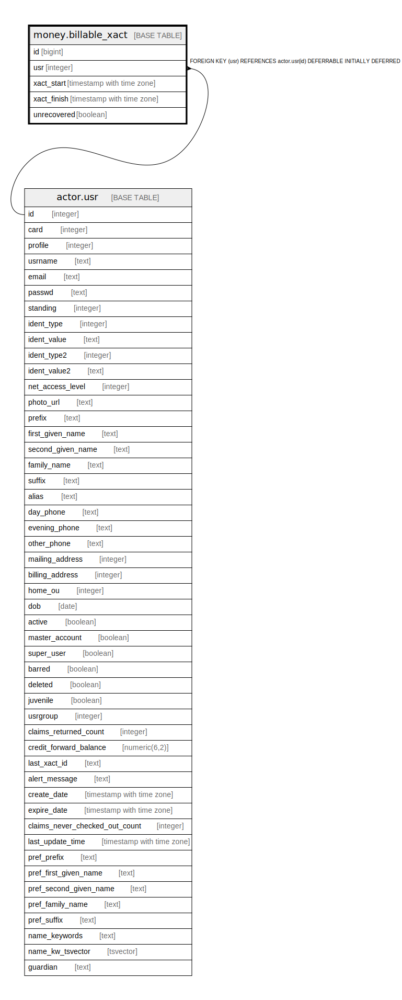

# money.billable_xact

## Description

## Columns

| Name | Type | Default | Nullable | Children | Parents | Comment |
| ---- | ---- | ------- | -------- | -------- | ------- | ------- |
| id | bigint | nextval('money.billable_xact_id_seq'::regclass) | false |  |  |  |
| usr | integer |  | false |  | [actor.usr](actor.usr.md) |  |
| xact_start | timestamp with time zone | now() | false |  |  |  |
| xact_finish | timestamp with time zone |  | true |  |  |  |
| unrecovered | boolean |  | true |  |  |  |

## Constraints

| Name | Type | Definition |
| ---- | ---- | ---------- |
| money_billable_xact_usr_fkey | FOREIGN KEY | FOREIGN KEY (usr) REFERENCES actor.usr(id) DEFERRABLE INITIALLY DEFERRED |
| billable_xact_pkey | PRIMARY KEY | PRIMARY KEY (id) |

## Indexes

| Name | Definition |
| ---- | ---------- |
| billable_xact_pkey | CREATE UNIQUE INDEX billable_xact_pkey ON money.billable_xact USING btree (id) |
| m_b_x_open_xacts_idx | CREATE INDEX m_b_x_open_xacts_idx ON money.billable_xact USING btree (usr) |

## Relations

---

> Generated by [tbls](https://github.com/k1LoW/tbls)
