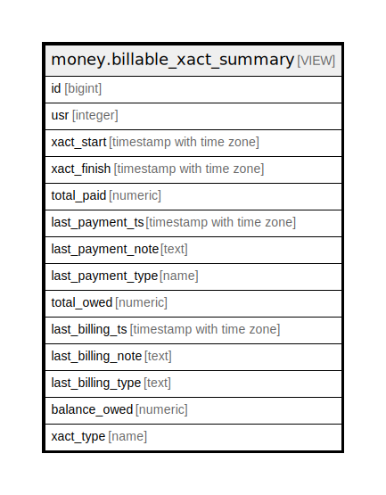

# money.billable_xact_summary

## Description

<details>
<summary><strong>Table Definition</strong></summary>

```sql
CREATE VIEW billable_xact_summary AS (
 SELECT materialized_billable_xact_summary.id,
    materialized_billable_xact_summary.usr,
    materialized_billable_xact_summary.xact_start,
    materialized_billable_xact_summary.xact_finish,
    materialized_billable_xact_summary.total_paid,
    materialized_billable_xact_summary.last_payment_ts,
    materialized_billable_xact_summary.last_payment_note,
    materialized_billable_xact_summary.last_payment_type,
    materialized_billable_xact_summary.total_owed,
    materialized_billable_xact_summary.last_billing_ts,
    materialized_billable_xact_summary.last_billing_note,
    materialized_billable_xact_summary.last_billing_type,
    materialized_billable_xact_summary.balance_owed,
    materialized_billable_xact_summary.xact_type
   FROM money.materialized_billable_xact_summary
)
```

</details>

## Columns

| Name | Type | Default | Nullable | Children | Parents | Comment |
| ---- | ---- | ------- | -------- | -------- | ------- | ------- |
| id | bigint |  | true |  |  |  |
| usr | integer |  | true |  |  |  |
| xact_start | timestamp with time zone |  | true |  |  |  |
| xact_finish | timestamp with time zone |  | true |  |  |  |
| total_paid | numeric |  | true |  |  |  |
| last_payment_ts | timestamp with time zone |  | true |  |  |  |
| last_payment_note | text |  | true |  |  |  |
| last_payment_type | name |  | true |  |  |  |
| total_owed | numeric |  | true |  |  |  |
| last_billing_ts | timestamp with time zone |  | true |  |  |  |
| last_billing_note | text |  | true |  |  |  |
| last_billing_type | text |  | true |  |  |  |
| balance_owed | numeric |  | true |  |  |  |
| xact_type | name |  | true |  |  |  |

## Referenced Tables

| Name | Columns | Comment | Type |
| ---- | ------- | ------- | ---- |
| [money.materialized_billable_xact_summary](money.materialized_billable_xact_summary.md) | 14 |  | BASE TABLE |

## Relations



---

> Generated by [tbls](https://github.com/k1LoW/tbls)
