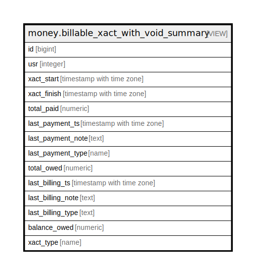

# money.billable_xact_with_void_summary

## Description

<details>
<summary><strong>Table Definition</strong></summary>

```sql
CREATE VIEW billable_xact_with_void_summary AS (
 SELECT xact.id,
    xact.usr,
    xact.xact_start,
    xact.xact_finish,
    sum(credit.amount) AS total_paid,
    max(credit.payment_ts) AS last_payment_ts,
    last(credit.note) AS last_payment_note,
    last(credit.payment_type) AS last_payment_type,
    sum(debit.amount) AS total_owed,
    max(debit.billing_ts) AS last_billing_ts,
    last(debit.note) AS last_billing_note,
    last(debit.billing_type) AS last_billing_type,
    (COALESCE(sum(debit.amount), (0)::numeric) - COALESCE(sum(credit.amount), (0)::numeric)) AS balance_owed,
    p.relname AS xact_type
   FROM (((money.billable_xact xact
     JOIN pg_class p ON ((xact.tableoid = p.oid)))
     LEFT JOIN money.billing debit ON ((xact.id = debit.xact)))
     LEFT JOIN money.payment_view credit ON ((xact.id = credit.xact)))
  GROUP BY xact.id, xact.usr, xact.xact_start, xact.xact_finish, p.relname
  ORDER BY (max(debit.billing_ts)), (max(credit.payment_ts))
)
```

</details>

## Columns

| Name | Type | Default | Nullable | Children | Parents | Comment |
| ---- | ---- | ------- | -------- | -------- | ------- | ------- |
| id | bigint |  | true |  |  |  |
| usr | integer |  | true |  |  |  |
| xact_start | timestamp with time zone |  | true |  |  |  |
| xact_finish | timestamp with time zone |  | true |  |  |  |
| total_paid | numeric |  | true |  |  |  |
| last_payment_ts | timestamp with time zone |  | true |  |  |  |
| last_payment_note | text |  | true |  |  |  |
| last_payment_type | name |  | true |  |  |  |
| total_owed | numeric |  | true |  |  |  |
| last_billing_ts | timestamp with time zone |  | true |  |  |  |
| last_billing_note | text |  | true |  |  |  |
| last_billing_type | text |  | true |  |  |  |
| balance_owed | numeric |  | true |  |  |  |
| xact_type | name |  | true |  |  |  |

## Referenced Tables

| Name | Columns | Comment | Type |
| ---- | ------- | ------- | ---- |
| [money.billable_xact](money.billable_xact.md) | 5 |  | BASE TABLE |
| [pg_class](pg_class.md) | 0 |  |  |
| [money.billing](money.billing.md) | 13 |  | BASE TABLE |
| [money.payment_view](money.payment_view.md) | 7 |  | VIEW |

## Relations



---

> Generated by [tbls](https://github.com/k1LoW/tbls)
