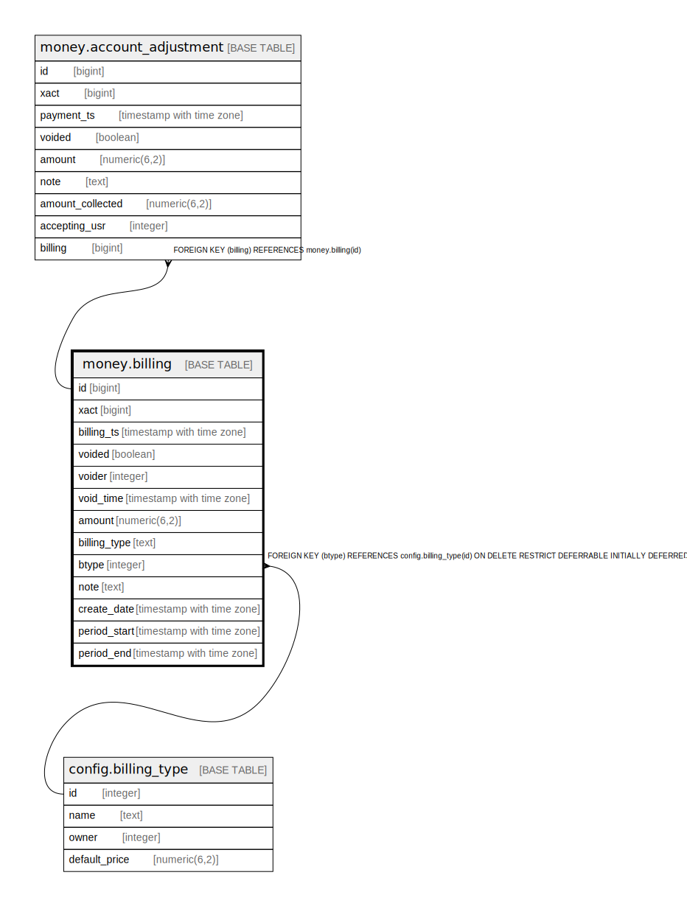

# money.billing

## Description

## Columns

| Name | Type | Default | Nullable | Children | Parents | Comment |
| ---- | ---- | ------- | -------- | -------- | ------- | ------- |
| id | bigint | nextval('money.billing_id_seq'::regclass) | false | [money.account_adjustment](money.account_adjustment.md) |  |  |
| xact | bigint |  | false |  |  |  |
| billing_ts | timestamp with time zone | now() | false |  |  |  |
| voided | boolean | false | false |  |  |  |
| voider | integer |  | true |  |  |  |
| void_time | timestamp with time zone |  | true |  |  |  |
| amount | numeric(6,2) |  | false |  |  |  |
| billing_type | text |  | false |  |  |  |
| btype | integer |  | false |  | [config.billing_type](config.billing_type.md) |  |
| note | text |  | true |  |  |  |
| create_date | timestamp with time zone | now() | false |  |  |  |
| period_start | timestamp with time zone |  | true |  |  |  |
| period_end | timestamp with time zone |  | true |  |  |  |

## Constraints

| Name | Type | Definition |
| ---- | ---- | ---------- |
| billing_btype_fkey | FOREIGN KEY | FOREIGN KEY (btype) REFERENCES config.billing_type(id) ON DELETE RESTRICT DEFERRABLE INITIALLY DEFERRED |
| billing_pkey | PRIMARY KEY | PRIMARY KEY (id) |

## Indexes

| Name | Definition |
| ---- | ---------- |
| billing_pkey | CREATE UNIQUE INDEX billing_pkey ON money.billing USING btree (id) |
| m_b_create_date_idx | CREATE INDEX m_b_create_date_idx ON money.billing USING btree (create_date) |
| m_b_period_end_idx | CREATE INDEX m_b_period_end_idx ON money.billing USING btree (period_end) |
| m_b_period_start_idx | CREATE INDEX m_b_period_start_idx ON money.billing USING btree (period_start) |
| m_b_time_idx | CREATE INDEX m_b_time_idx ON money.billing USING btree (billing_ts) |
| m_b_voider_idx | CREATE INDEX m_b_voider_idx ON money.billing USING btree (voider) |
| m_b_xact_idx | CREATE INDEX m_b_xact_idx ON money.billing USING btree (xact) |

## Triggers

| Name | Definition |
| ---- | ---------- |
| maintain_billing_ts_tgr | CREATE TRIGGER maintain_billing_ts_tgr BEFORE INSERT OR UPDATE ON money.billing FOR EACH ROW EXECUTE PROCEDURE money.maintain_billing_ts() |
| mat_summary_add_tgr | CREATE TRIGGER mat_summary_add_tgr AFTER INSERT ON money.billing FOR EACH ROW EXECUTE PROCEDURE money.materialized_summary_billing_add() |
| mat_summary_del_tgr | CREATE TRIGGER mat_summary_del_tgr BEFORE DELETE ON money.billing FOR EACH ROW EXECUTE PROCEDURE money.materialized_summary_billing_del() |
| mat_summary_upd_tgr | CREATE TRIGGER mat_summary_upd_tgr AFTER UPDATE ON money.billing FOR EACH ROW EXECUTE PROCEDURE money.materialized_summary_billing_update() |

## Relations

---

> Generated by [tbls](https://github.com/k1LoW/tbls)
