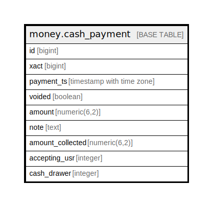

# money.cash_payment

## Description

## Columns

| Name | Type | Default | Nullable | Children | Parents | Comment |
| ---- | ---- | ------- | -------- | -------- | ------- | ------- |
| id | bigint | nextval('money.payment_id_seq'::regclass) | false |  |  |  |
| xact | bigint |  | false |  |  |  |
| payment_ts | timestamp with time zone | now() | false |  |  |  |
| voided | boolean | false | false |  |  |  |
| amount | numeric(6,2) |  | false |  |  |  |
| note | text |  | true |  |  |  |
| amount_collected | numeric(6,2) |  | false |  |  |  |
| accepting_usr | integer |  | false |  |  |  |
| cash_drawer | integer |  | true |  |  |  |

## Constraints

| Name | Type | Definition |
| ---- | ---- | ---------- |
| cash_payment_pkey | PRIMARY KEY | PRIMARY KEY (id) |

## Indexes

| Name | Definition |
| ---- | ---------- |
| cash_payment_pkey | CREATE UNIQUE INDEX cash_payment_pkey ON money.cash_payment USING btree (id) |
| money_cash_id_idx | CREATE INDEX money_cash_id_idx ON money.cash_payment USING btree (id) |
| money_cash_payment_accepting_usr_idx | CREATE INDEX money_cash_payment_accepting_usr_idx ON money.cash_payment USING btree (accepting_usr) |
| money_cash_payment_cash_drawer_idx | CREATE INDEX money_cash_payment_cash_drawer_idx ON money.cash_payment USING btree (cash_drawer) |
| money_cash_payment_ts_idx | CREATE INDEX money_cash_payment_ts_idx ON money.cash_payment USING btree (payment_ts) |
| money_cash_payment_xact_idx | CREATE INDEX money_cash_payment_xact_idx ON money.cash_payment USING btree (xact) |

## Triggers

| Name | Definition |
| ---- | ---------- |
| mat_summary_add_tgr | CREATE TRIGGER mat_summary_add_tgr AFTER INSERT ON money.cash_payment FOR EACH ROW EXECUTE PROCEDURE money.materialized_summary_payment_add('cash_payment') |
| mat_summary_del_tgr | CREATE TRIGGER mat_summary_del_tgr BEFORE DELETE ON money.cash_payment FOR EACH ROW EXECUTE PROCEDURE money.materialized_summary_payment_del('cash_payment') |
| mat_summary_upd_tgr | CREATE TRIGGER mat_summary_upd_tgr AFTER UPDATE ON money.cash_payment FOR EACH ROW EXECUTE PROCEDURE money.materialized_summary_payment_update('cash_payment') |

## Relations

---

> Generated by [tbls](https://github.com/k1LoW/tbls)
