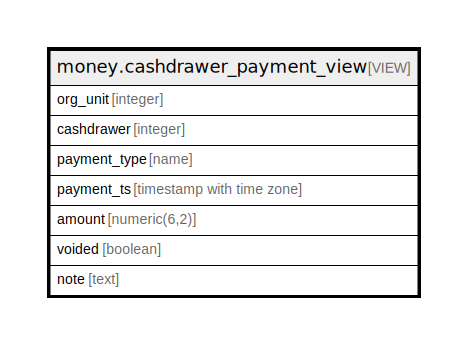

# money.cashdrawer_payment_view

## Description

<details>
<summary><strong>Table Definition</strong></summary>

```sql
CREATE VIEW cashdrawer_payment_view AS (
 SELECT ou.id AS org_unit,
    ws.id AS cashdrawer,
    t.payment_type,
    p.payment_ts,
    p.amount,
    p.voided,
    p.note
   FROM (((actor.org_unit ou
     JOIN actor.workstation ws ON ((ou.id = ws.owning_lib)))
     LEFT JOIN money.bnm_desk_payment p ON ((ws.id = p.cash_drawer)))
     LEFT JOIN money.payment_view t ON ((p.id = t.id)))
)
```

</details>

## Columns

| Name | Type | Default | Nullable | Children | Parents | Comment |
| ---- | ---- | ------- | -------- | -------- | ------- | ------- |
| org_unit | integer |  | true |  |  |  |
| cashdrawer | integer |  | true |  |  |  |
| payment_type | name |  | true |  |  |  |
| payment_ts | timestamp with time zone |  | true |  |  |  |
| amount | numeric(6,2) |  | true |  |  |  |
| voided | boolean |  | true |  |  |  |
| note | text |  | true |  |  |  |

## Referenced Tables

| Name | Columns | Comment | Type |
| ---- | ------- | ------- | ---- |
| [actor.org_unit](actor.org_unit.md) | 13 |  | BASE TABLE |
| [actor.workstation](actor.workstation.md) | 3 |  | BASE TABLE |
| [money.bnm_desk_payment](money.bnm_desk_payment.md) | 9 |  | BASE TABLE |
| [money.payment_view](money.payment_view.md) | 7 |  | VIEW |

## Relations



---

> Generated by [tbls](https://github.com/k1LoW/tbls)
