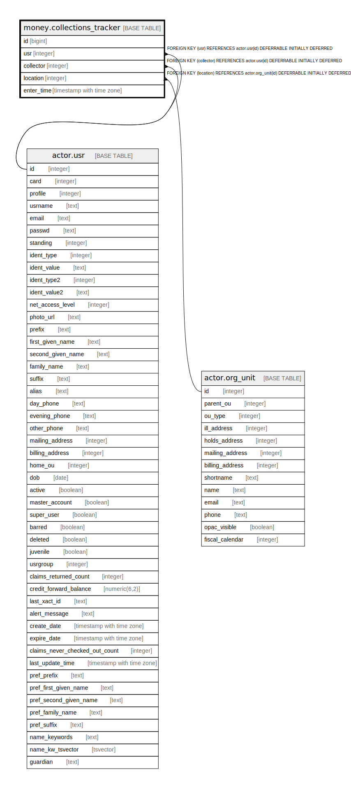

# money.collections_tracker

## Description

## Columns

| Name | Type | Default | Nullable | Children | Parents | Comment |
| ---- | ---- | ------- | -------- | -------- | ------- | ------- |
| id | bigint | nextval('money.collections_tracker_id_seq'::regclass) | false |  |  |  |
| usr | integer |  | false |  | [actor.usr](actor.usr.md) |  |
| collector | integer |  | false |  | [actor.usr](actor.usr.md) |  |
| location | integer |  | false |  | [actor.org_unit](actor.org_unit.md) |  |
| enter_time | timestamp with time zone |  | true |  |  |  |

## Constraints

| Name | Type | Definition |
| ---- | ---- | ---------- |
| collections_tracker_location_fkey | FOREIGN KEY | FOREIGN KEY (location) REFERENCES actor.org_unit(id) DEFERRABLE INITIALLY DEFERRED |
| collections_tracker_collector_fkey | FOREIGN KEY | FOREIGN KEY (collector) REFERENCES actor.usr(id) DEFERRABLE INITIALLY DEFERRED |
| collections_tracker_usr_fkey | FOREIGN KEY | FOREIGN KEY (usr) REFERENCES actor.usr(id) DEFERRABLE INITIALLY DEFERRED |
| collections_tracker_pkey | PRIMARY KEY | PRIMARY KEY (id) |

## Indexes

| Name | Definition |
| ---- | ---------- |
| collections_tracker_pkey | CREATE UNIQUE INDEX collections_tracker_pkey ON money.collections_tracker USING btree (id) |
| m_c_t_collector_idx | CREATE INDEX m_c_t_collector_idx ON money.collections_tracker USING btree (collector) |
| m_c_t_usr_collector_location_once_idx | CREATE UNIQUE INDEX m_c_t_usr_collector_location_once_idx ON money.collections_tracker USING btree (usr, collector, location) |

## Relations

---

> Generated by [tbls](https://github.com/k1LoW/tbls)
