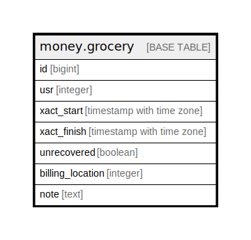

# money.grocery

## Description

## Columns

| Name | Type | Default | Nullable | Children | Parents | Comment |
| ---- | ---- | ------- | -------- | -------- | ------- | ------- |
| id | bigint | nextval('money.billable_xact_id_seq'::regclass) | false |  |  |  |
| usr | integer |  | false |  |  |  |
| xact_start | timestamp with time zone | now() | false |  |  |  |
| xact_finish | timestamp with time zone |  | true |  |  |  |
| unrecovered | boolean |  | true |  |  |  |
| billing_location | integer |  | false |  |  |  |
| note | text |  | true |  |  |  |

## Constraints

| Name | Type | Definition |
| ---- | ---- | ---------- |
| grocery_pkey | PRIMARY KEY | PRIMARY KEY (id) |

## Indexes

| Name | Definition |
| ---- | ---------- |
| grocery_pkey | CREATE UNIQUE INDEX grocery_pkey ON money.grocery USING btree (id) |
| circ_open_date_idx | CREATE INDEX circ_open_date_idx ON money.grocery USING btree (xact_start) WHERE (xact_finish IS NULL) |
| m_g_usr_idx | CREATE INDEX m_g_usr_idx ON money.grocery USING btree (usr) |

## Triggers

| Name | Definition |
| ---- | ---------- |
| mat_summary_change_tgr | CREATE TRIGGER mat_summary_change_tgr AFTER UPDATE ON money.grocery FOR EACH ROW EXECUTE PROCEDURE money.mat_summary_update() |
| mat_summary_create_tgr | CREATE TRIGGER mat_summary_create_tgr AFTER INSERT ON money.grocery FOR EACH ROW EXECUTE PROCEDURE money.mat_summary_create('grocery') |
| mat_summary_remove_tgr | CREATE TRIGGER mat_summary_remove_tgr AFTER DELETE ON money.grocery FOR EACH ROW EXECUTE PROCEDURE money.mat_summary_delete() |

## Relations

---

> Generated by [tbls](https://github.com/k1LoW/tbls)
