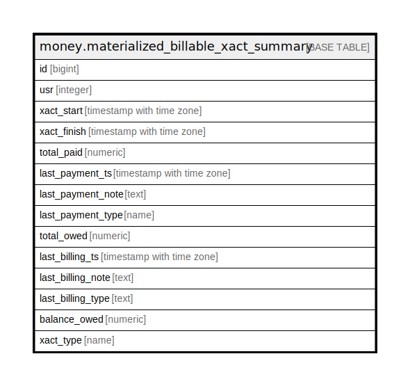

# money.materialized_billable_xact_summary

## Description

## Columns

| Name | Type | Default | Nullable | Children | Parents | Comment |
| ---- | ---- | ------- | -------- | -------- | ------- | ------- |
| id | bigint |  | false |  |  |  |
| usr | integer |  | true |  |  |  |
| xact_start | timestamp with time zone |  | true |  |  |  |
| xact_finish | timestamp with time zone |  | true |  |  |  |
| total_paid | numeric |  | true |  |  |  |
| last_payment_ts | timestamp with time zone |  | true |  |  |  |
| last_payment_note | text |  | true |  |  |  |
| last_payment_type | name |  | true |  |  |  |
| total_owed | numeric |  | true |  |  |  |
| last_billing_ts | timestamp with time zone |  | true |  |  |  |
| last_billing_note | text |  | true |  |  |  |
| last_billing_type | text |  | true |  |  |  |
| balance_owed | numeric |  | true |  |  |  |
| xact_type | name |  | true |  |  |  |

## Constraints

| Name | Type | Definition |
| ---- | ---- | ---------- |
| materialized_billable_xact_summary_pkey | PRIMARY KEY | PRIMARY KEY (id) |

## Indexes

| Name | Definition |
| ---- | ---------- |
| materialized_billable_xact_summary_pkey | CREATE UNIQUE INDEX materialized_billable_xact_summary_pkey ON money.materialized_billable_xact_summary USING btree (id) |
| money_mat_summary_usr_idx | CREATE INDEX money_mat_summary_usr_idx ON money.materialized_billable_xact_summary USING btree (usr) |
| money_mat_summary_xact_start_idx | CREATE INDEX money_mat_summary_xact_start_idx ON money.materialized_billable_xact_summary USING btree (xact_start) |

## Relations

---

> Generated by [tbls](https://github.com/k1LoW/tbls)
