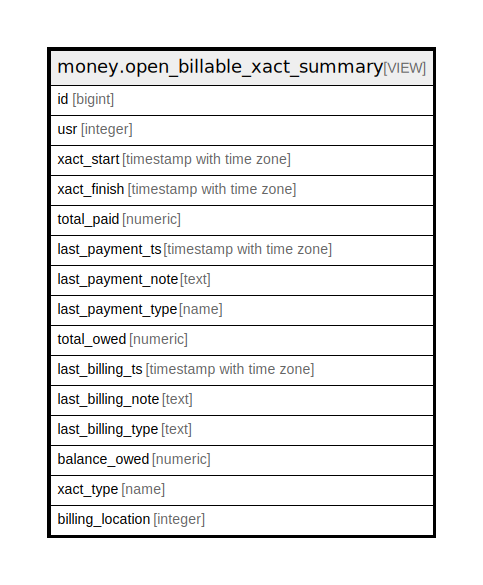

# money.open_billable_xact_summary

## Description

<details>
<summary><strong>Table Definition</strong></summary>

```sql
CREATE VIEW open_billable_xact_summary AS (
 SELECT billable_xact_summary_location_view.id,
    billable_xact_summary_location_view.usr,
    billable_xact_summary_location_view.xact_start,
    billable_xact_summary_location_view.xact_finish,
    billable_xact_summary_location_view.total_paid,
    billable_xact_summary_location_view.last_payment_ts,
    billable_xact_summary_location_view.last_payment_note,
    billable_xact_summary_location_view.last_payment_type,
    billable_xact_summary_location_view.total_owed,
    billable_xact_summary_location_view.last_billing_ts,
    billable_xact_summary_location_view.last_billing_note,
    billable_xact_summary_location_view.last_billing_type,
    billable_xact_summary_location_view.balance_owed,
    billable_xact_summary_location_view.xact_type,
    billable_xact_summary_location_view.billing_location
   FROM money.billable_xact_summary_location_view
  WHERE (billable_xact_summary_location_view.xact_finish IS NULL)
)
```

</details>

## Columns

| Name | Type | Default | Nullable | Children | Parents | Comment |
| ---- | ---- | ------- | -------- | -------- | ------- | ------- |
| id | bigint |  | true |  |  |  |
| usr | integer |  | true |  |  |  |
| xact_start | timestamp with time zone |  | true |  |  |  |
| xact_finish | timestamp with time zone |  | true |  |  |  |
| total_paid | numeric |  | true |  |  |  |
| last_payment_ts | timestamp with time zone |  | true |  |  |  |
| last_payment_note | text |  | true |  |  |  |
| last_payment_type | name |  | true |  |  |  |
| total_owed | numeric |  | true |  |  |  |
| last_billing_ts | timestamp with time zone |  | true |  |  |  |
| last_billing_note | text |  | true |  |  |  |
| last_billing_type | text |  | true |  |  |  |
| balance_owed | numeric |  | true |  |  |  |
| xact_type | name |  | true |  |  |  |
| billing_location | integer |  | true |  |  |  |

## Referenced Tables

| Name | Columns | Comment | Type |
| ---- | ------- | ------- | ---- |
| [money.billable_xact_summary_location_view](money.billable_xact_summary_location_view.md) | 15 |  | VIEW |

## Relations



---

> Generated by [tbls](https://github.com/k1LoW/tbls)
