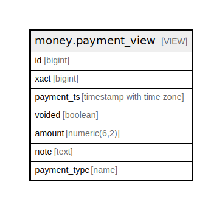

# money.payment_view

## Description

<details>
<summary><strong>Table Definition</strong></summary>

```sql
CREATE VIEW payment_view AS (
 SELECT p.id,
    p.xact,
    p.payment_ts,
    p.voided,
    p.amount,
    p.note,
    c.relname AS payment_type
   FROM (money.payment p
     JOIN pg_class c ON ((p.tableoid = c.oid)))
)
```

</details>

## Columns

| Name | Type | Default | Nullable | Children | Parents | Comment |
| ---- | ---- | ------- | -------- | -------- | ------- | ------- |
| id | bigint |  | true |  |  |  |
| xact | bigint |  | true |  |  |  |
| payment_ts | timestamp with time zone |  | true |  |  |  |
| voided | boolean |  | true |  |  |  |
| amount | numeric(6,2) |  | true |  |  |  |
| note | text |  | true |  |  |  |
| payment_type | name |  | true |  |  |  |

## Referenced Tables

| Name | Columns | Comment | Type |
| ---- | ------- | ------- | ---- |
| [money.payment](money.payment.md) | 6 |  | BASE TABLE |
| [pg_class](pg_class.md) | 0 |  |  |

## Relations



---

> Generated by [tbls](https://github.com/k1LoW/tbls)
