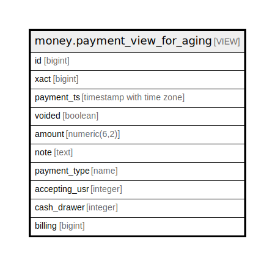

# money.payment_view_for_aging

## Description

<details>
<summary><strong>Table Definition</strong></summary>

```sql
CREATE VIEW payment_view_for_aging AS (
 SELECT p.id,
    p.xact,
    p.payment_ts,
    p.voided,
    p.amount,
    p.note,
    p.payment_type,
    bnm.accepting_usr,
    bnmd.cash_drawer,
    maa.billing
   FROM (((money.payment_view p
     LEFT JOIN money.bnm_payment bnm ON ((bnm.id = p.id)))
     LEFT JOIN money.bnm_desk_payment bnmd ON ((bnmd.id = p.id)))
     LEFT JOIN money.account_adjustment maa ON ((maa.id = p.id)))
)
```

</details>

## Columns

| Name | Type | Default | Nullable | Children | Parents | Comment |
| ---- | ---- | ------- | -------- | -------- | ------- | ------- |
| id | bigint |  | true |  |  |  |
| xact | bigint |  | true |  |  |  |
| payment_ts | timestamp with time zone |  | true |  |  |  |
| voided | boolean |  | true |  |  |  |
| amount | numeric(6,2) |  | true |  |  |  |
| note | text |  | true |  |  |  |
| payment_type | name |  | true |  |  |  |
| accepting_usr | integer |  | true |  |  |  |
| cash_drawer | integer |  | true |  |  |  |
| billing | bigint |  | true |  |  |  |

## Referenced Tables

| Name | Columns | Comment | Type |
| ---- | ------- | ------- | ---- |
| [money.payment_view](money.payment_view.md) | 7 |  | VIEW |
| [money.bnm_payment](money.bnm_payment.md) | 8 |  | BASE TABLE |
| [money.bnm_desk_payment](money.bnm_desk_payment.md) | 9 |  | BASE TABLE |
| [money.account_adjustment](money.account_adjustment.md) | 9 |  | BASE TABLE |

## Relations



---

> Generated by [tbls](https://github.com/k1LoW/tbls)
