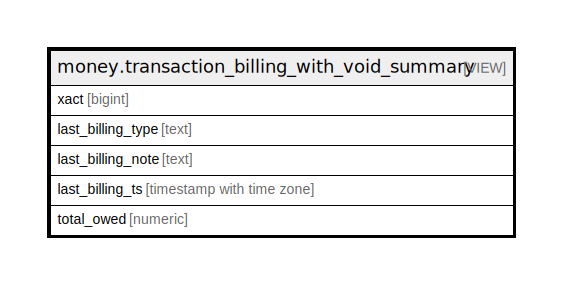

# money.transaction_billing_with_void_summary

## Description

<details>
<summary><strong>Table Definition</strong></summary>

```sql
CREATE VIEW transaction_billing_with_void_summary AS (
 SELECT billing.xact,
    last(billing.billing_type) AS last_billing_type,
    last(billing.note) AS last_billing_note,
    max(billing.billing_ts) AS last_billing_ts,
    sum(
        CASE
            WHEN billing.voided THEN (0)::numeric
            ELSE COALESCE(billing.amount, (0)::numeric)
        END) AS total_owed
   FROM money.billing
  GROUP BY billing.xact
  ORDER BY (max(billing.billing_ts))
)
```

</details>

## Columns

| Name | Type | Default | Nullable | Children | Parents | Comment |
| ---- | ---- | ------- | -------- | -------- | ------- | ------- |
| xact | bigint |  | true |  |  |  |
| last_billing_type | text |  | true |  |  |  |
| last_billing_note | text |  | true |  |  |  |
| last_billing_ts | timestamp with time zone |  | true |  |  |  |
| total_owed | numeric |  | true |  |  |  |

## Referenced Tables

| Name | Columns | Comment | Type |
| ---- | ------- | ------- | ---- |
| [money.billing](money.billing.md) | 13 |  | BASE TABLE |

## Relations



---

> Generated by [tbls](https://github.com/k1LoW/tbls)
