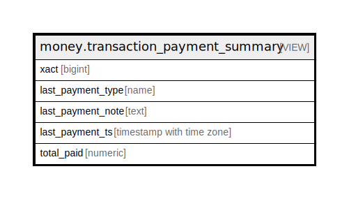

# money.transaction_payment_summary

## Description

<details>
<summary><strong>Table Definition</strong></summary>

```sql
CREATE VIEW transaction_payment_summary AS (
 SELECT payment_view.xact,
    last(payment_view.payment_type) AS last_payment_type,
    last(payment_view.note) AS last_payment_note,
    max(payment_view.payment_ts) AS last_payment_ts,
    sum(COALESCE(payment_view.amount, (0)::numeric)) AS total_paid
   FROM money.payment_view
  WHERE (payment_view.voided IS FALSE)
  GROUP BY payment_view.xact
  ORDER BY (max(payment_view.payment_ts))
)
```

</details>

## Columns

| Name | Type | Default | Nullable | Children | Parents | Comment |
| ---- | ---- | ------- | -------- | -------- | ------- | ------- |
| xact | bigint |  | true |  |  |  |
| last_payment_type | name |  | true |  |  |  |
| last_payment_note | text |  | true |  |  |  |
| last_payment_ts | timestamp with time zone |  | true |  |  |  |
| total_paid | numeric |  | true |  |  |  |

## Referenced Tables

| Name | Columns | Comment | Type |
| ---- | ------- | ------- | ---- |
| [money.payment_view](money.payment_view.md) | 7 |  | VIEW |

## Relations



---

> Generated by [tbls](https://github.com/k1LoW/tbls)
