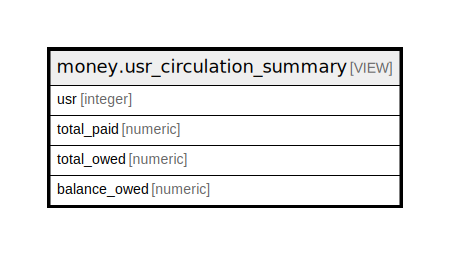

# money.usr_circulation_summary

## Description

<details>
<summary><strong>Table Definition</strong></summary>

```sql
CREATE VIEW usr_circulation_summary AS (
 SELECT billable_xact_summary.usr,
    sum(billable_xact_summary.total_paid) AS total_paid,
    sum(billable_xact_summary.total_owed) AS total_owed,
    sum(billable_xact_summary.balance_owed) AS balance_owed
   FROM money.billable_xact_summary
  WHERE (billable_xact_summary.xact_type = 'circulation'::name)
  GROUP BY billable_xact_summary.usr
)
```

</details>

## Columns

| Name | Type | Default | Nullable | Children | Parents | Comment |
| ---- | ---- | ------- | -------- | -------- | ------- | ------- |
| usr | integer |  | true |  |  |  |
| total_paid | numeric |  | true |  |  |  |
| total_owed | numeric |  | true |  |  |  |
| balance_owed | numeric |  | true |  |  |  |

## Referenced Tables

| Name | Columns | Comment | Type |
| ---- | ------- | ------- | ---- |
| [money.billable_xact_summary](money.billable_xact_summary.md) | 14 |  | VIEW |

## Relations



---

> Generated by [tbls](https://github.com/k1LoW/tbls)
