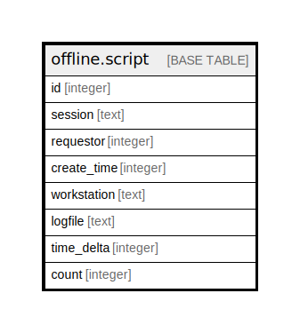

# offline.script

## Description

## Columns

| Name | Type | Default | Nullable | Children | Parents | Comment |
| ---- | ---- | ------- | -------- | -------- | ------- | ------- |
| id | integer | nextval('offline.script_id_seq'::regclass) | false |  |  |  |
| session | text |  | false |  |  |  |
| requestor | integer |  | false |  |  |  |
| create_time | integer |  | false |  |  |  |
| workstation | text |  | false |  |  |  |
| logfile | text |  | false |  |  |  |
| time_delta | integer | 0 | false |  |  |  |
| count | integer | 0 | false |  |  |  |

## Constraints

| Name | Type | Definition |
| ---- | ---- | ---------- |
| script_pkey | PRIMARY KEY | PRIMARY KEY (id) |

## Indexes

| Name | Definition |
| ---- | ---------- |
| script_pkey | CREATE UNIQUE INDEX script_pkey ON offline.script USING btree (id) |
| offline_script_pkey | CREATE INDEX offline_script_pkey ON offline.script USING btree (id) |
| offline_script_session | CREATE INDEX offline_script_session ON offline.script USING btree (session) |
| offline_script_ws | CREATE INDEX offline_script_ws ON offline.script USING btree (workstation) |

## Relations

---

> Generated by [tbls](https://github.com/k1LoW/tbls)
