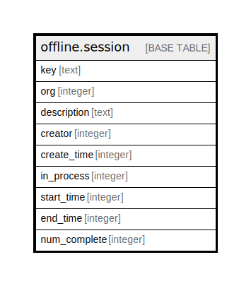

# offline.session

## Description

## Columns

| Name | Type | Default | Nullable | Children | Parents | Comment |
| ---- | ---- | ------- | -------- | -------- | ------- | ------- |
| key | text |  | false |  |  |  |
| org | integer |  | false |  |  |  |
| description | text |  | true |  |  |  |
| creator | integer |  | false |  |  |  |
| create_time | integer |  | false |  |  |  |
| in_process | integer | 0 | false |  |  |  |
| start_time | integer |  | true |  |  |  |
| end_time | integer |  | true |  |  |  |
| num_complete | integer | 0 | false |  |  |  |

## Constraints

| Name | Type | Definition |
| ---- | ---- | ---------- |
| session_pkey | PRIMARY KEY | PRIMARY KEY (key) |

## Indexes

| Name | Definition |
| ---- | ---------- |
| session_pkey | CREATE UNIQUE INDEX session_pkey ON offline.session USING btree (key) |
| offline_session_creation | CREATE INDEX offline_session_creation ON offline.session USING btree (create_time) |
| offline_session_org | CREATE INDEX offline_session_org ON offline.session USING btree (org) |
| offline_session_pkey | CREATE INDEX offline_session_pkey ON offline.session USING btree (key) |

## Relations

---

> Generated by [tbls](https://github.com/k1LoW/tbls)
