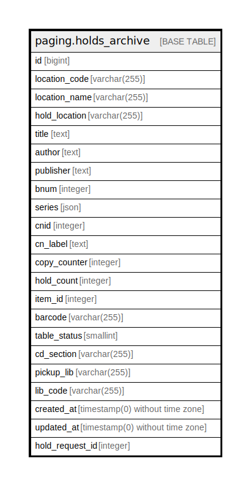

# paging.holds_archive

## Description

## Columns

| Name | Type | Default | Nullable | Children | Parents | Comment |
| ---- | ---- | ------- | -------- | -------- | ------- | ------- |
| id | bigint | nextval('paging.holds_archive_id_seq'::regclass) | false |  |  |  |
| location_code | varchar(255) |  | true |  |  |  |
| location_name | varchar(255) |  | true |  |  |  |
| hold_location | varchar(255) |  | false |  |  |  |
| title | text |  | true |  |  |  |
| author | text |  | true |  |  |  |
| publisher | text |  | true |  |  |  |
| bnum | integer |  | true |  |  |  |
| series | json |  | true |  |  |  |
| cnid | integer |  | true |  |  |  |
| cn_label | text |  | true |  |  |  |
| copy_counter | integer |  | true |  |  |  |
| hold_count | integer |  | true |  |  |  |
| item_id | integer |  | true |  |  |  |
| barcode | varchar(255) |  | true |  |  |  |
| table_status | smallint |  | true |  |  |  |
| cd_section | varchar(255) |  | true |  |  |  |
| pickup_lib | varchar(255) |  | true |  |  |  |
| lib_code | varchar(255) |  | true |  |  |  |
| created_at | timestamp(0) without time zone |  | true |  |  |  |
| updated_at | timestamp(0) without time zone |  | true |  |  |  |
| hold_request_id | integer |  | true |  |  |  |

## Constraints

| Name | Type | Definition |
| ---- | ---- | ---------- |
| holds_archive_pkey | PRIMARY KEY | PRIMARY KEY (id) |

## Indexes

| Name | Definition |
| ---- | ---------- |
| holds_archive_pkey | CREATE UNIQUE INDEX holds_archive_pkey ON paging.holds_archive USING btree (id) |

## Relations

---

> Generated by [tbls](https://github.com/k1LoW/tbls)
