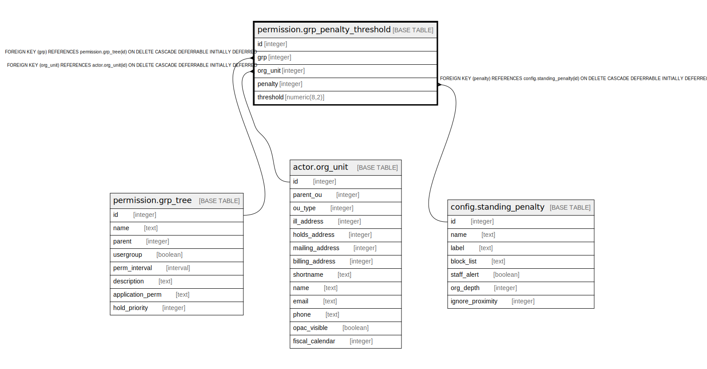

# permission.grp_penalty_threshold

## Description

## Columns

| Name | Type | Default | Nullable | Children | Parents | Comment |
| ---- | ---- | ------- | -------- | -------- | ------- | ------- |
| id | integer | nextval('permission.grp_penalty_threshold_id_seq'::regclass) | false |  |  |  |
| grp | integer |  | false |  | [permission.grp_tree](permission.grp_tree.md) |  |
| org_unit | integer |  | false |  | [actor.org_unit](actor.org_unit.md) |  |
| penalty | integer |  | false |  | [config.standing_penalty](config.standing_penalty.md) |  |
| threshold | numeric(8,2) |  | false |  |  |  |

## Constraints

| Name | Type | Definition |
| ---- | ---- | ---------- |
| grp_penalty_threshold_org_unit_fkey | FOREIGN KEY | FOREIGN KEY (org_unit) REFERENCES actor.org_unit(id) ON DELETE CASCADE DEFERRABLE INITIALLY DEFERRED |
| grp_penalty_threshold_penalty_fkey | FOREIGN KEY | FOREIGN KEY (penalty) REFERENCES config.standing_penalty(id) ON DELETE CASCADE DEFERRABLE INITIALLY DEFERRED |
| grp_penalty_threshold_pkey | PRIMARY KEY | PRIMARY KEY (id) |
| grp_penalty_threshold_grp_fkey | FOREIGN KEY | FOREIGN KEY (grp) REFERENCES permission.grp_tree(id) ON DELETE CASCADE DEFERRABLE INITIALLY DEFERRED |
| penalty_grp_once | UNIQUE | UNIQUE (grp, penalty, org_unit) |

## Indexes

| Name | Definition |
| ---- | ---------- |
| grp_penalty_threshold_pkey | CREATE UNIQUE INDEX grp_penalty_threshold_pkey ON permission.grp_penalty_threshold USING btree (id) |
| penalty_grp_once | CREATE UNIQUE INDEX penalty_grp_once ON permission.grp_penalty_threshold USING btree (grp, penalty, org_unit) |

## Relations

---

> Generated by [tbls](https://github.com/k1LoW/tbls)
