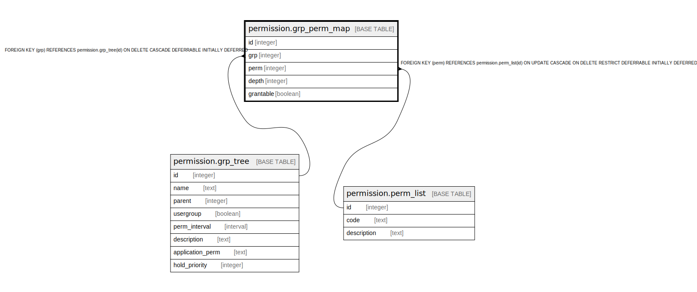

# permission.grp_perm_map

## Description

## Columns

| Name | Type | Default | Nullable | Children | Parents | Comment |
| ---- | ---- | ------- | -------- | -------- | ------- | ------- |
| id | integer | nextval('permission.grp_perm_map_id_seq'::regclass) | false |  |  |  |
| grp | integer |  | false |  | [permission.grp_tree](permission.grp_tree.md) |  |
| perm | integer |  | false |  | [permission.perm_list](permission.perm_list.md) |  |
| depth | integer |  | false |  |  |  |
| grantable | boolean | false | false |  |  |  |

## Constraints

| Name | Type | Definition |
| ---- | ---- | ---------- |
| grp_perm_map_pkey | PRIMARY KEY | PRIMARY KEY (id) |
| grp_perm_map_grp_fkey | FOREIGN KEY | FOREIGN KEY (grp) REFERENCES permission.grp_tree(id) ON DELETE CASCADE DEFERRABLE INITIALLY DEFERRED |
| perm_grp_once | UNIQUE | UNIQUE (grp, perm) |
| grp_perm_map_perm_fkey | FOREIGN KEY | FOREIGN KEY (perm) REFERENCES permission.perm_list(id) ON UPDATE CASCADE ON DELETE RESTRICT DEFERRABLE INITIALLY DEFERRED |

## Indexes

| Name | Definition |
| ---- | ---------- |
| grp_perm_map_pkey | CREATE UNIQUE INDEX grp_perm_map_pkey ON permission.grp_perm_map USING btree (id) |
| perm_grp_once | CREATE UNIQUE INDEX perm_grp_once ON permission.grp_perm_map USING btree (grp, perm) |

## Relations

---

> Generated by [tbls](https://github.com/k1LoW/tbls)
