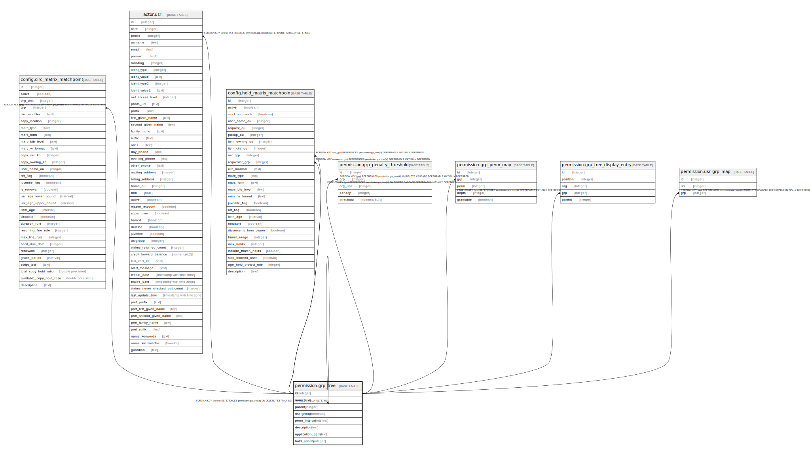

# permission.grp_tree

## Description

## Columns

| Name | Type | Default | Nullable | Children | Parents | Comment |
| ---- | ---- | ------- | -------- | -------- | ------- | ------- |
| id | integer | nextval('permission.grp_tree_id_seq'::regclass) | false | [config.circ_matrix_matchpoint](config.circ_matrix_matchpoint.md) [actor.usr](actor.usr.md) [permission.grp_tree](permission.grp_tree.md) [config.hold_matrix_matchpoint](config.hold_matrix_matchpoint.md) [permission.grp_penalty_threshold](permission.grp_penalty_threshold.md) [permission.grp_perm_map](permission.grp_perm_map.md) [permission.grp_tree_display_entry](permission.grp_tree_display_entry.md) [permission.usr_grp_map](permission.usr_grp_map.md) |  |  |
| name | text |  | false |  |  |  |
| parent | integer |  | true |  | [permission.grp_tree](permission.grp_tree.md) |  |
| usergroup | boolean | true | false |  |  |  |
| perm_interval | interval | '3 years'::interval | false |  |  |  |
| description | text |  | true |  |  |  |
| application_perm | text |  | true |  |  |  |
| hold_priority | integer | 0 | false |  |  |  |

## Constraints

| Name | Type | Definition |
| ---- | ---- | ---------- |
| grp_tree_name_key | UNIQUE | UNIQUE (name) |
| grp_tree_parent_fkey | FOREIGN KEY | FOREIGN KEY (parent) REFERENCES permission.grp_tree(id) ON DELETE RESTRICT DEFERRABLE INITIALLY DEFERRED |
| grp_tree_pkey | PRIMARY KEY | PRIMARY KEY (id) |

## Indexes

| Name | Definition |
| ---- | ---------- |
| grp_tree_name_key | CREATE UNIQUE INDEX grp_tree_name_key ON permission.grp_tree USING btree (name) |
| grp_tree_pkey | CREATE UNIQUE INDEX grp_tree_pkey ON permission.grp_tree USING btree (id) |
| grp_tree_parent_idx | CREATE INDEX grp_tree_parent_idx ON permission.grp_tree USING btree (parent) |

## Relations

---

> Generated by [tbls](https://github.com/k1LoW/tbls)
