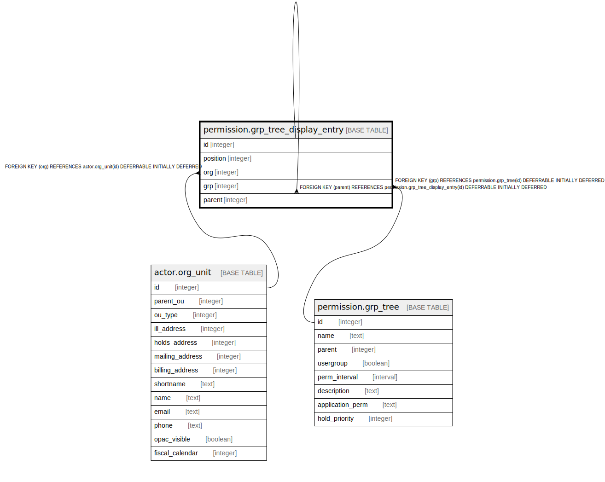

# permission.grp_tree_display_entry

## Description

## Columns

| Name | Type | Default | Nullable | Children | Parents | Comment |
| ---- | ---- | ------- | -------- | -------- | ------- | ------- |
| id | integer | nextval('permission.grp_tree_display_entry_id_seq'::regclass) | false | [permission.grp_tree_display_entry](permission.grp_tree_display_entry.md) |  |  |
| position | integer |  | false |  |  |  |
| org | integer |  | false |  | [actor.org_unit](actor.org_unit.md) |  |
| grp | integer |  | false |  | [permission.grp_tree](permission.grp_tree.md) |  |
| parent | integer |  | true |  | [permission.grp_tree_display_entry](permission.grp_tree_display_entry.md) |  |

## Constraints

| Name | Type | Definition |
| ---- | ---- | ---------- |
| grp_tree_display_entry_org_fkey | FOREIGN KEY | FOREIGN KEY (org) REFERENCES actor.org_unit(id) DEFERRABLE INITIALLY DEFERRED |
| grp_tree_display_entry_parent_fkey | FOREIGN KEY | FOREIGN KEY (parent) REFERENCES permission.grp_tree_display_entry(id) DEFERRABLE INITIALLY DEFERRED |
| grp_tree_display_entry_pkey | PRIMARY KEY | PRIMARY KEY (id) |
| grp_tree_display_entry_grp_fkey | FOREIGN KEY | FOREIGN KEY (grp) REFERENCES permission.grp_tree(id) DEFERRABLE INITIALLY DEFERRED |
| pgtde_once_per_org | UNIQUE | UNIQUE (org, grp) |

## Indexes

| Name | Definition |
| ---- | ---------- |
| grp_tree_display_entry_pkey | CREATE UNIQUE INDEX grp_tree_display_entry_pkey ON permission.grp_tree_display_entry USING btree (id) |
| pgtde_once_per_org | CREATE UNIQUE INDEX pgtde_once_per_org ON permission.grp_tree_display_entry USING btree (org, grp) |

## Relations

---

> Generated by [tbls](https://github.com/k1LoW/tbls)
