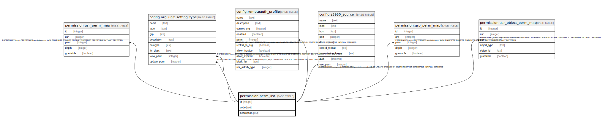

# permission.perm_list

## Description

## Columns

| Name | Type | Default | Nullable | Children | Parents | Comment |
| ---- | ---- | ------- | -------- | -------- | ------- | ------- |
| id | integer | nextval('permission.perm_list_id_seq'::regclass) | false | [permission.usr_perm_map](permission.usr_perm_map.md) [config.org_unit_setting_type](config.org_unit_setting_type.md) [config.remoteauth_profile](config.remoteauth_profile.md) [config.z3950_source](config.z3950_source.md) [permission.grp_perm_map](permission.grp_perm_map.md) [permission.usr_object_perm_map](permission.usr_object_perm_map.md) |  |  |
| code | text |  | false |  |  |  |
| description | text |  | true |  |  |  |

## Constraints

| Name | Type | Definition |
| ---- | ---- | ---------- |
| perm_list_code_key | UNIQUE | UNIQUE (code) |
| perm_list_pkey | PRIMARY KEY | PRIMARY KEY (id) |

## Indexes

| Name | Definition |
| ---- | ---------- |
| perm_list_code_key | CREATE UNIQUE INDEX perm_list_code_key ON permission.perm_list USING btree (code) |
| perm_list_pkey | CREATE UNIQUE INDEX perm_list_pkey ON permission.perm_list USING btree (id) |
| perm_list_code_idx | CREATE INDEX perm_list_code_idx ON permission.perm_list USING btree (code) |

## Triggers

| Name | Definition |
| ---- | ---------- |
| maintain_perm_i18n_tgr | CREATE TRIGGER maintain_perm_i18n_tgr AFTER UPDATE ON permission.perm_list FOR EACH ROW EXECUTE PROCEDURE oils_i18n_id_tracking('ppl') |

## Relations

---

> Generated by [tbls](https://github.com/k1LoW/tbls)
